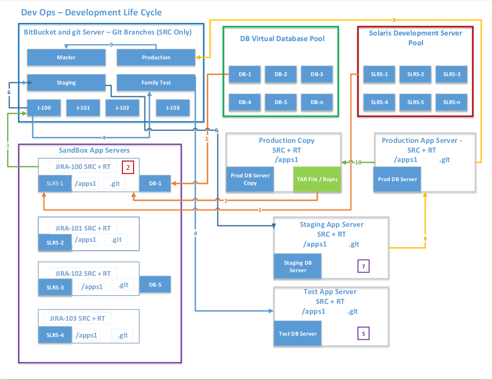
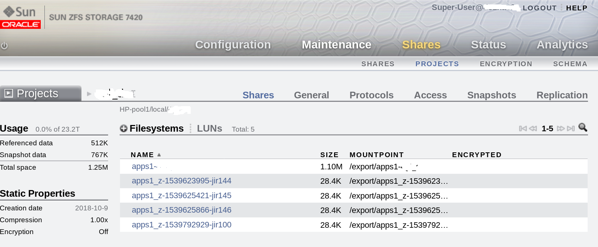

# devops-on-solaris
Creating a DevOps like on Solaris

This repository contains a copy of the Oracle Solaris Python DevOps Script as well as all related reqierd SMF and related startup scripts. compatible / tested with Oracle Solaris 11.3/11.4+

This document provides instructions on how to install and use the Solaris Python DevOps Script. the script helps automate Oracle Solaris Zone deployments as well as snap/cloning a ZFS associated file systems which then gets mounted in the zone by NFS, created on a ZFS Appliance. See the deployment notes for additional details.

<i>Script Options</i>.
<pre>
./devops_manager.py -h           
usage: devops_manager.py [-h] [-e [{test,dev,stage}]] -u USER [-p [PASSWORD]]
                         [-t [{app,db}]] [-v DBVERSION]
                         [-s | -d | -r {app,db}] [-U USERID | -a [ALL]]
                         [-i  | -l [{sum,det,listZones}] | -n ]

Create VM(zone) with associated /apps1 clone

optional arguments:
  -h, --help            show this help message and exit
  -e [{test,dev,stage}], --env [{test,dev,stage}]
                        select environment dev, test, stage(default is dev)
  -u USER, --user USER  create zone with give login credentials.
  -p [PASSWORD], --password [PASSWORD]
                        password for give login credentials.
  -t [{app,db}], --appType [{app,db}]
                        select zone/VM type. app or db(default is app)
  -v DBVERSION, --dbVersion DBVERSION
                        create / rotate zone using given db version(default is
                        db_version in devops_config.ini).
  -s, --imgStat         returns VM(zone) live information, e.g. Global Zone,
                        IP, Port, File System, details.
  -d, --delete          delete VM(zone) with associated snap(s)
  -r {app,db}, --rotateImg {app,db}
                        rotate / sync update /apps1. for informix DB: refresh
                        to latest DB copy(/ifxsrv).
  -U USERID, --userID USERID
                        returns zones created by given user ID.
  -a [ALL], --all [ALL]
                        returns zones created by all users.
  -i [], --jiraid []    associated Jira ID
  -l [{sum,det,listZones}], --listZones [{sum,det,listZones}]
                        list all active zones, options are summary or
                        details(sum, det)
  -n [], --dbVers []    New / updated DB version
</pre>
 
<b>Version 0.8.1</b>
Miner fix / update to be able to set ldap servers, user dn in the devops_manager.ini file.

<b>Version 0.8</b>
This version adds many new features, including creating different zone types, security like user/password/roles to create zones, better zone reporting. make sure to read the <a href="VERSION.md">release notes</a> for all changes.

<b>Version 0.7.1</b>

This version greatly improves / simplifies all configuration modifications by using the Python <i>ConfigParser</i> module.

<b>Detail release notes are available <a href="VERSION.md">available here</a></b>.

<h3>Getting Started</h3>

<h4>Installation</h4>
<h4>Dependencies / Prerequisites</h4>
<b>The following Python libraries are required:</b>
<pre>
# Modules
import os
import re
import sys
import pwd
import time
import datetime
import json
import ldap
import getpass
import logging
import configparser
import argparse
import pickledb
from subprocess import PIPE, Popen
from multiprocessing import Process
import requests
requests.packages.urllib3.disable_warnings()

# Rad modules
import rad.bindings.com.oracle.solaris.rad.zonemgr as zonemgr
import rad.bindings.com.oracle.solaris.rad.smf_1 as smf
import rad.bindings.com.oracle.solaris.rad.kstat_1 as kbind
import rad.client as radc
import rad.connect as radcon
import rad.auth as rada
# import rad.bindings.com.oracle.solaris.rad.zonesbridge as zbind
</pre>
<i>Note: </i>You can install libraries by running <i>pip install [library] or (if available) by doing a pkg install [library] form the Oracle Solaris repository.</i>

<h4>Application Layout Details</h4>
The directory layout are explained below.
<ol>
<li><b>main/devops_manager.py:</b> main script, to create/delete/stats clones</li>
<li><b>main/devops_config.ini:</b> main configuration file.</li>
<li><b>main/db_version.ini:</b> conatins the curent db version number.</li>
<li><b>main/access.db:</b> conatins all access user roles.</li>
<li><b>main/fork_clones.py:</b> stress test / fork script - run with with the argument [number simultaneous runs]</li>
<li><b>main/bin/scripts:</b> directory contains smf startup related scripts - create on source zone to be cloned on evrey zone</li>
<li><b>main/conf/xml_files:</b> directory contains smf related xml files, LDAP cert files, used at cloning time </li>
</ol>

For the full installation details you can follow this document <a href="docs/README.md">installation documentation</a>.
docs/index.html

<h4>Additional Detail</h4>

Below is an exmaple workflow we are using.
 

<h4>Usage examples</h4>
To use the script, follow the steps below.
<pre>
./devops_manager.py -h           
usage: devops_manager.py [-h] [-e [{test,dev,stage}]] -u USER [-p [PASSWORD]]
                         [-t [{app,db}]] [-v DBVERSION]
                         [-s | -d | -r {app,db}] [-U USERID | -a [ALL]]
                         [-i  | -l [{sum,det,listZones}] | -n ]

Create VM(zone) with associated /apps1 clone

optional arguments:
  -h, --help            show this help message and exit
  -e [{test,dev,stage}], --env [{test,dev,stage}]
                        select environment dev, test, stage(default is dev)
  -u USER, --user USER  create zone with give login credentials.
  -p [PASSWORD], --password [PASSWORD]
                        password for give login credentials.
  -t [{app,db}], --appType [{app,db}]
                        select zone/VM type. app or db(default is app)
  -v DBVERSION, --dbVersion DBVERSION
                        create / rotate zone using given db version(default is
                        db_version in devops_config.ini).
  -s, --imgStat         returns VM(zone) live information, e.g. Global Zone,
                        IP, Port, File System, details.
  -d, --delete          delete VM(zone) with associated snap(s)
  -r {app,db}, --rotateImg {app,db}
                        rotate / sync update /apps1. for informix DB: refresh
                        to latest DB copy(/ifxsrv).
  -U USERID, --userID USERID
                        returns zones created by given user ID.
  -a [ALL], --all [ALL]
                        returns zones created by all users.
  -i [], --jiraid []    associated Jira ID
  -l [{sum,det,listZones}], --listZones [{sum,det,listZones}]
                        list all active zones, options are summary or
                        details(sum, det)
  -n [], --dbVers []    New / updated DB version
</pre>

To clone a regular zone(app) just run something like the below.
<pre>
./devops_manager.py -i -u user -i jiraMenu3
Please enter user's LDAP password :
Note: you are accessing this application as a: admin

Evaluating system resources availability. Please wait...
Cloning VM/Zone z-1559231863-jiraMenu3 and associated file systems
Progress is being logged to zone_vm.log
--------------------------------
Cloning VM/Zone z-1559231863-jiraMenu3 and associated file systems
Progress is being logged to zone_vm.log
--------------------------------
===============================================================
******* NOTE: Informix is only running on dc1-devops1 *******
                         (devops1)                       
===============================================================

-------========= Active data center =========------- 
        VM/Zone Name: z-1559231863-jiraMenu3 
        Hostname: devops1 
        Zone Port: 31020 
        DB Port: 31520 
        Internal IP Address: 10.25.0.20
        VM Mount source: apps1_z-source
        DB Mount source: ifxdb-do_v-5-z-1559231863-jiraMenu3
        VM Mount destination: /apps1
        DB Mount destination: /ifxsrv
Installation of zone z-1559231863-jiraMenu3 in HA successfully completed.

-------========= Standby data center =========-------
[snip]...
</pre>

To clone a DB zone just run something like the below.
<pre>
./devops_manager.py -i db105 -u usera -t db -p
Note: you are accessing this application as a: admin
Evaluating system resources availability. Please wait...
Getting latest available db version for ifxdb-do_v-.
Successfully got next version as ifxdb-do_v-5.
Cloning VM/Zone z-db-v5-1556825338-db105 and associated file systems
Progress is being logged to zone_vm.log
--------------------------------
Cloning VM/Zone z-db-v5-1556825338-db105 and associated file systems
Progress is being logged to zone_vm.log
--------------------------------
Sync to new db ifxdb-do_v-5 is in progress.. please be patient...
This can take approximately 10-15 minutes to complete.
Note: The sync is running in HA only i.e. DR will complete first with data available once HA is up.
[snip]...
</pre>

And the log file will look something like the below.
<pre>
cat zone_vm.log
# Failed attempt.
2018-10-17 13:43:42,745:z-1539798222-jir10:INFO: Validating configuration request.
2018-10-17 13:43:43,048:z-1539798222-jir10:INFO: Snapshot snap_z-1539798222-jir10 is valid. continuing...
2018-10-17 13:43:43,385:z-1539798222-jir10:INFO: Clone apps1_z-1539798222-jir10 is valid. continuing...
2018-10-17 13:43:43,385:z-1539798222-jir10:INFO: Checking source zone availability...
2018-10-17 13:43:43,467:z-1539798222-jir10:ERROR: Source zone z-source, Stat: running, NOT available for cloning... exiting.

# Successful attempt.
2018-11-21 10:06:44,774:z-1542812804-jir162(HA):INFO: Verifying zone name is not in use, please wait...
2018-11-21 10:06:44,775:z-1542812804-jir162(HA):INFO: Checking Global Zone dc1-host1-gz
2018-11-21 10:06:53,319:z-1542812804-jir162(HA):INFO: Checking Global Zone dc1-host2-gz
2018-11-21 10:06:55,792:z-1542812804-jir162(HA):INFO: Checking Global Zone dc1-host3-gz
2018-11-21 10:06:56,234:z-1542812804-jir162(HA):INFO: Checking Global Zone dc1-host4-gz
2018-11-21 10:06:58,920:z-1542812804-jir162(HA):INFO: Zone name for jir162 is not in use, continuing...
2018-11-21 10:06:58,921:z-1542812804-jir162(HA):INFO: Evaluating system resource availability, please wait...
2018-11-21 10:07:11,265:z-1542812804-jir162(HA):INFO: Host: dc1-host1-gz, load-avg: 23.40, free-mem: 361347, total-active zones: 15.
2018-11-21 10:07:14,872:z-1542812804-jir162(HA):INFO: Host: dc1-host2-gz, load-avg: 4.55, free-mem: 140250, total-active zones: 5.
2018-11-21 10:07:15,241:z-1542812804-jir162(HA):INFO: Host: dc1-host3-gz, load-avg: 0.62, free-mem: 14243, total-active zones: 0.
2018-11-21 10:07:15,241:z-1542812804-jir162(HA):INFO: Skipping host dc1-host3-gz. CPU to high, or Memory to low.
2018-11-21 10:07:19,618:z-1542812804-jir162(HA):INFO: Host: dc1-host4-gz, load-avg: 0.14, free-mem: 186275, total-active zones: 7.
2018-11-21 10:07:19,618:z-1542812804-jir162(HA):INFO: Selecting Host: dc1-host4-gz with load average of 0.14.
2018-11-21 10:07:19,649:z-1542812804-jir162(HA):INFO: Validating configuration request.
2018-11-21 10:07:19,649:z-1542812804-jir162(DR):INFO: Checking source zone availability...
2018-11-21 10:07:19,944:z-1542812804-jir162(HA):INFO: Snapshot snap_z-1542812804-jir162 is valid. continuing...
2018-11-21 10:07:20,246:z-1542812804-jir162(HA):INFO: Clone apps1_z-1542812804-jir162 is valid. continuing...
2018-11-21 10:07:20,246:z-1542812804-jir162(HA):INFO: Checking source zone availability...
2018-11-21 10:07:21,608:z-1542812804-jir162(HA):INFO: Zone z-source is available(installed). continuing...
2018-11-21 10:07:21,608:z-1542812804-jir162(HA):INFO: Configuring new zone: z-1542812804-jir162...
2018-11-21 10:07:21,703:z-1542812804-jir162(DR):INFO: Zone z-source is available(installed). continuing...
2018-11-21 10:07:21,703:z-1542812804-jir162(DR):INFO: Configuring new zone: z-1542812804-jir162...
2018-11-21 10:07:22,489:z-1542812804-jir162(HA):INFO: Configuring zone z-1542812804-jir162 successful.
2018-11-21 10:07:22,489:z-1542812804-jir162(HA):INFO: All checks in ha passed, continuing.
2018-11-21 10:07:22,609:z-1542812804-jir162(HA):INFO: Preparing zone z-1542812804-jir162. Setting zone properties...
2018-11-21 10:07:22,742:z-1542812804-jir162(DR):INFO: Configuring zone z-1542812804-jir162 successful.
2018-11-21 10:07:22,742:z-1542812804-jir162(DR):INFO: All checks in dr passed, continuing.
2018-11-21 10:07:22,861:z-1542812804-jir162(DR):INFO: Preparing zone z-1542812804-jir162. Setting zone properties...
2018-11-21 10:07:23,848:z-1542812804-jir162(HA):INFO: Successfully set zone z-1542812804-jir162 properties.
2018-11-21 10:07:23,848:z-1542812804-jir162(HA):INFO: Cerating snapshot: snap_z-1542812804-jir162
2018-11-21 10:07:24,202:z-1542812804-jir162(DR):INFO: Successfully set zone z-1542812804-jir162 properties.
2018-11-21 10:07:24,202:z-1542812804-jir162(DR):INFO: CLONING VM/Zone
2018-11-21 10:07:24,323:z-1542812804-jir162(DR):INFO: Source zone: z-source
2018-11-21 10:07:24,442:z-1542812804-jir162(DR):INFO: Destination zone: z-1542812804-jir162
2018-11-21 10:07:24,442:z-1542812804-jir162(DR):INFO: Please wait...
2018-11-21 10:07:24,443:z-1542812804-jir162(DR):INFO: Generating zone port, used with SSH.
2018-11-21 10:07:24,515:z-1542812804-jir162(HA):INFO: Snapshot created successfully.
2018-11-21 10:07:24,515:z-1542812804-jir162(HA):INFO: Verifying snapshot availability.
2018-11-21 10:07:24,564:z-1542812804-jir162(DR):INFO: Generated 31018 as the zone SSH port.
2018-11-21 10:07:24,803:z-1542812804-jir162(HA):INFO: Snapshot snap_z-1542812804-jir162 available. continuing...
2018-11-21 10:07:24,804:z-1542812804-jir162(HA):INFO: CLONING file-systems
2018-11-21 10:07:24,804:z-1542812804-jir162(HA):INFO: Source: /apps1
2018-11-21 10:07:24,804:z-1542812804-jir162(HA):INFO: Destination: apps1_z-1542812804-jir162
2018-11-21 10:07:24,804:z-1542812804-jir162(HA):INFO: Please wait...
2018-11-21 10:07:27,853:z-1542812804-jir162(HA):INFO: Successfully created clone apps1_z-1542812804-jir162
2018-11-21 10:07:27,853:z-1542812804-jir162(HA):INFO: CLONING VM/Zone
2018-11-21 10:07:27,970:z-1542812804-jir162(HA):INFO: Source zone: z-source
2018-11-21 10:07:28,090:z-1542812804-jir162(HA):INFO: Destination zone: z-1542812804-jir162
2018-11-21 10:07:28,091:z-1542812804-jir162(HA):INFO: Please wait...
2018-11-21 10:07:28,091:z-1542812804-jir162(HA):INFO: Generating zone port, used with SSH.
2018-11-21 10:07:28,214:z-1542812804-jir162(HA):INFO: Generated 31018 as the zone SSH port.
2018-11-21 10:08:13,045:z-1542812804-jir162(HA):INFO: Successfully created zone z-1542812804-jir162
2018-11-21 10:08:13,285:z-1542812804-jir162(HA):INFO: Booting VM/Zone z-1542812804-jir162 for the first time. Please wait...
2018-11-21 10:08:23,079:z-1542812804-jir162(HA):INFO: Successfully booted VM/Zone z-1542812804-jir162.
2018-11-21 10:08:23,198:z-1542812804-jir162(HA):INFO: Verifying VM/Zone z-1542812804-jir162 RAD connection availability.
2018-11-21 10:08:23,859:z-1542812804-jir162(HA):INFO: RAD server is not accessible yet.
2018-11-21 10:08:25,339:z-1542812804-jir162(HA):INFO: RAD server is not accessible yet.
2018-11-21 10:08:26,819:z-1542812804-jir162(HA):INFO: RAD server is not accessible yet.
2018-11-21 10:08:28,243:z-1542812804-jir162(DR):INFO: Successfully created zone z-1542812804-jir162
2018-11-21 10:08:28,300:z-1542812804-jir162(HA):INFO: RAD server is not accessible yet.
2018-11-21 10:08:28,482:z-1542812804-jir162(DR):INFO: Booting VM/Zone z-1542812804-jir162 for the first time. Please wait...
2018-11-21 10:08:29,781:z-1542812804-jir162(HA):INFO: RAD server is not accessible yet.
2018-11-21 10:08:31,262:z-1542812804-jir162(HA):INFO: RAD server is not accessible yet.
2018-11-21 10:08:32,741:z-1542812804-jir162(HA):INFO: RAD server is not accessible yet.
2018-11-21 10:08:34,222:z-1542812804-jir162(HA):INFO: RAD server is not accessible yet.
2018-11-21 10:08:35,703:z-1542812804-jir162(HA):INFO: RAD server is not accessible yet.
2018-11-21 10:08:37,182:z-1542812804-jir162(HA):INFO: RAD server is not accessible yet.
2018-11-21 10:08:38,663:z-1542812804-jir162(HA):INFO: RAD server is not accessible yet.
2018-11-21 10:08:40,144:z-1542812804-jir162(HA):INFO: RAD server is not accessible yet.
2018-11-21 10:08:41,624:z-1542812804-jir162(HA):INFO: RAD server is not accessible yet.
2018-11-21 10:08:42,328:z-1542812804-jir162(DR):INFO: Successfully booted VM/Zone z-1542812804-jir162.
2018-11-21 10:08:42,447:z-1542812804-jir162(DR):INFO: Verifying VM/Zone z-1542812804-jir162 RAD connection availability.
2018-11-21 10:08:44,067:z-1542812804-jir162(HA):INFO: RAD server is accessible.
2018-11-21 10:08:44,165:z-1542812804-jir162(DR):INFO: RAD server is not accessible yet.
2018-11-21 10:08:45,335:z-1542812804-jir162(HA):INFO: Waiting for network services to come ONLINE, curently DISABLED.
2018-11-21 10:08:45,650:z-1542812804-jir162(DR):INFO: RAD server is not accessible yet.
2018-11-21 10:08:47,129:z-1542812804-jir162(DR):INFO: RAD server is not accessible yet.
2018-11-21 10:08:48,058:z-1542812804-jir162(HA):INFO: Waiting for network services to come ONLINE, curently DISABLED.
2018-11-21 10:08:48,610:z-1542812804-jir162(DR):INFO: RAD server is not accessible yet.
2018-11-21 10:08:50,092:z-1542812804-jir162(DR):INFO: RAD server is not accessible yet.
2018-11-21 10:08:51,197:z-1542812804-jir162(HA):INFO: Waiting for network services to come ONLINE, curently DISABLED.
2018-11-21 10:08:51,571:z-1542812804-jir162(DR):INFO: RAD server is not accessible yet.
2018-11-21 10:08:53,051:z-1542812804-jir162(DR):INFO: RAD server is not accessible yet.
2018-11-21 10:08:54,531:z-1542812804-jir162(DR):INFO: RAD server is not accessible yet.
2018-11-21 10:08:56,980:z-1542812804-jir162(DR):INFO: RAD server is accessible.
2018-11-21 10:08:57,830:z-1542812804-jir162(HA):INFO: Waiting for network services to come ONLINE, curently DISABLED.
2018-11-21 10:08:59,463:z-1542812804-jir162(DR):INFO: Waiting for network services to come ONLINE, curently DISABLED.
2018-11-21 10:09:00,552:z-1542812804-jir162(HA):INFO: Waiting for network services to come ONLINE, curently DISABLED.
2018-11-21 10:09:03,224:z-1542812804-jir162(DR):INFO: Waiting for network services to come ONLINE, curently DISABLED.
2018-11-21 10:09:03,272:z-1542812804-jir162(HA):INFO: Waiting for network services to come ONLINE, curently DISABLED.
2018-11-21 10:09:05,992:z-1542812804-jir162(HA):INFO: Waiting for network services to come ONLINE, curently DISABLED.
2018-11-21 10:09:08,713:z-1542812804-jir162(HA):INFO: Waiting for network services to come ONLINE, curently DISABLED.
2018-11-21 10:09:09,768:z-1542812804-jir162(DR):INFO: Waiting for network services to come ONLINE, curently DISABLED.
2018-11-21 10:09:11,436:z-1542812804-jir162(HA):INFO: Waiting for network services to come ONLINE, curently DISABLED.
2018-11-21 10:09:12,488:z-1542812804-jir162(DR):INFO: Waiting for network services to come ONLINE, curently DISABLED.
2018-11-21 10:09:14,154:z-1542812804-jir162(HA):INFO: Waiting for network services to come ONLINE, curently DISABLED.
2018-11-21 10:09:15,209:z-1542812804-jir162(DR):INFO: Waiting for network services to come ONLINE, curently DISABLED.
2018-11-21 10:09:16,875:z-1542812804-jir162(HA):INFO: Waiting for network services to come ONLINE, curently DISABLED.
2018-11-21 10:09:17,929:z-1542812804-jir162(DR):INFO: Waiting for network services to come ONLINE, curently DISABLED.
2018-11-21 10:09:19,598:z-1542812804-jir162(HA):INFO: Waiting for network services to come ONLINE, curently DISABLED.
2018-11-21 10:09:20,862:z-1542812804-jir162(DR):INFO: Waiting for network services to come ONLINE, curently DISABLED.
2018-11-21 10:09:24,052:z-1542812804-jir162(DR):INFO: Waiting for network services to come ONLINE, curently DISABLED.
2018-11-21 10:09:25,810:z-1542812804-jir162(HA):INFO: Waiting for network services to come ONLINE, curently DISABLED.
2018-11-21 10:09:26,776:z-1542812804-jir162(DR):INFO: Waiting for network services to come ONLINE, curently DISABLED.
2018-11-21 10:09:28,529:z-1542812804-jir162(HA):INFO: Waiting for network services to come ONLINE, curently DISABLED.
2018-11-21 10:09:29,494:z-1542812804-jir162(DR):INFO: Waiting for network services to come ONLINE, curently DISABLED.
2018-11-21 10:09:31,251:z-1542812804-jir162(HA):INFO: Waiting for network services to come ONLINE, curently DISABLED.
2018-11-21 10:09:32,214:z-1542812804-jir162(DR):INFO: Waiting for network services to come ONLINE, curently DISABLED.
2018-11-21 10:09:33,973:z-1542812804-jir162(HA):INFO: Waiting for network services to come ONLINE, curently OFFLINE.
2018-11-21 10:09:34,935:z-1542812804-jir162(DR):INFO: Waiting for network services to come ONLINE, curently DISABLED.
2018-11-21 10:09:36,693:z-1542812804-jir162(HA):INFO: Waiting for network services to come ONLINE, curently OFFLINE.
2018-11-21 10:09:37,658:z-1542812804-jir162(DR):INFO: Waiting for network services to come ONLINE, curently DISABLED.
2018-11-21 10:09:39,413:z-1542812804-jir162(HA):INFO: Waiting for network services to come ONLINE, curently OFFLINE.
2018-11-21 10:09:40,376:z-1542812804-jir162(DR):INFO: Waiting for network services to come ONLINE, curently DISABLED.
2018-11-21 10:09:42,135:z-1542812804-jir162(HA):INFO: Waiting for network services to come ONLINE, curently OFFLINE.
2018-11-21 10:09:43,100:z-1542812804-jir162(DR):INFO: Waiting for network services to come ONLINE, curently DISABLED.
2018-11-21 10:09:44,854:z-1542812804-jir162(HA):INFO: Waiting for network services to come ONLINE, curently OFFLINE.
2018-11-21 10:09:47,336:z-1542812804-jir162(HA):INFO: Enabling service related to mount /apps1, in zone z-1542812804-jir162.
2018-11-21 10:09:48,145:z-1542812804-jir162(HA):INFO: Service enabled for /apps1 mount. successful.
2018-11-21 10:09:48,265:z-1542812804-jir162(HA):INFO: Getting z-1542812804-jir162 IP and Port information.
2018-11-21 10:09:49,708:z-1542812804-jir162(HA):INFO: New VM/Zone is available on dc1-host4-gz, with IP Address: 10.25.0.18 Port 31018
2018-11-21 10:09:49,946:z-1542812804-jir162(HA):INFO: Installation of zone z-1542812804-jir162 in HA successfully completed.
2018-11-21 10:09:56,932:z-1542812804-jir162(DR):INFO: Waiting for network services to come ONLINE, curently DISABLED.
2018-11-21 10:09:59,654:z-1542812804-jir162(DR):INFO: Waiting for network services to come ONLINE, curently DISABLED.
2018-11-21 10:10:02,375:z-1542812804-jir162(DR):INFO: Waiting for network services to come ONLINE, curently DISABLED.
2018-11-21 10:10:05,096:z-1542812804-jir162(DR):INFO: Waiting for network services to come ONLINE, curently DISABLED.
2018-11-21 10:10:07,819:z-1542812804-jir162(DR):INFO: Waiting for network services to come ONLINE, curently OFFLINE.
2018-11-21 10:10:10,538:z-1542812804-jir162(DR):INFO: Waiting for network services to come ONLINE, curently OFFLINE.
2018-11-21 10:10:13,257:z-1542812804-jir162(DR):INFO: Waiting for network services to come ONLINE, curently OFFLINE.
2018-11-21 10:10:15,738:z-1542812804-jir162(DR):INFO: Enabling service related to mount /apps1, in zone z-1542812804-jir162.
2018-11-21 10:10:16,580:z-1542812804-jir162(DR):INFO: Service enabled for /apps1 mount. successful.
2018-11-21 10:10:16,698:z-1542812804-jir162(DR):INFO: Getting z-1542812804-jir162 IP and Port information.
2018-11-21 10:10:18,141:z-1542812804-jir162(DR):INFO: New VM/Zone is available on dc2-host4-gz, with IP Address: 10.25.0.18 Port 31018
2018-11-21 10:10:18,379:z-1542812804-jir162(DR):INFO: Installation of zone z-1542812804-jir162 in DR successfully completed.
</pre>

To access the Zone/VM you just ssh to the global-zone port in this example 31018.
<pre>
ssh global-zone -p 31018
</pre>
Similar you can delete the zone by running the below (it will delete all associated snaps/clones).
<pre>
./devops_manager.py -d -i jir162
Finding server containing zone for jir162 in HA.
Finding server containing zone for jir162 in DR.
Found jir162 on dc2-host4-gz in dr.
Deleting VM/Zone z-1542812804-jir162 and associated snap_z-1542812804-jir162 on dc2-host4-gz.
Progress is being logged in zone_vm.log
--------------------------------
Found jir162 on dc1-host4-gz in ha.
Deleting VM/Zone z-1542812804-jir162 and associated snap_z-1542812804-jir162 on dc1-host4-gz.
Progress is being logged in zone_vm.log
--------------------------------
Uninstall/delete completed successfully.
</pre>

Log output - with associated snaps/clones.
<pre>
2018-11-21 12:25:48,141:z-1542821148-jir162(HA):INFO: Finding server containing zone for jir162.
2018-11-21 12:25:48,142:z-1542821148-jir162(HA):INFO: Checking Global Zone dc1-host1-gz.
2018-11-21 12:25:48,143:z-1542821148-jir162(DR):INFO: Finding server containing zone for jir162.
2018-11-21 12:25:48,144:z-1542821148-jir162(DR):INFO: Checking Global Zone dc2-host1-gz.
2018-11-21 12:25:53,910:z-1542821148-jir162(DR):INFO: No VM/Zone for jir162 on dc2-host1-gz.
2018-11-21 12:25:53,911:z-1542821148-jir162(DR):INFO: Checking Global Zone dc2-host2-gz.
2018-11-21 12:25:56,387:z-1542821148-jir162(HA):INFO: No VM/Zone for jir162 on dc1-host1-gz.
2018-11-21 12:25:56,388:z-1542821148-jir162(HA):INFO: Checking Global Zone dc1-host2-gz.
2018-11-21 12:25:56,392:z-1542821148-jir162(DR):INFO: No VM/Zone for jir162 on dc2-host2-gz.
2018-11-21 12:25:56,393:z-1542821148-jir162(DR):INFO: Checking Global Zone dc2-host3-gz.
2018-11-21 12:25:56,767:z-1542821148-jir162(DR):INFO: No VM/Zone for jir162 on dc2-host3-gz.
2018-11-21 12:25:56,767:z-1542821148-jir162(DR):INFO: Checking Global Zone dc2-host4-gz.
2018-11-21 12:25:58,560:z-1542821148-jir162(HA):INFO: No VM/Zone for jir162 on dc1-host2-gz.
2018-11-21 12:25:58,561:z-1542821148-jir162(HA):INFO: Checking Global Zone dc1-host3-gz.
2018-11-21 12:25:59,026:z-1542821148-jir162(HA):INFO: No VM/Zone for jir162 on dc1-host3-gz.
2018-11-21 12:25:59,026:z-1542821148-jir162(HA):INFO: Checking Global Zone dc1-host4-gz.
2018-11-21 12:26:00,064:z-1542821148-jir162(DR):INFO: Found jir162 on dc2-host4-gz.
2018-11-21 12:26:00,064:z-1542821148-jir162(DR):INFO: Deleting VM/Zone z-1542812804-jir162 on dc2-host4-gz.
2018-11-21 12:26:00,306:z-1542821148-jir162(DR):INFO: Preparing removal of z-1542812804-jir162.
2018-11-21 12:26:00,425:z-1542821148-jir162(DR):INFO: Halting z-1542812804-jir162, please wait...
2018-11-21 12:26:02,152:z-1542821148-jir162(HA):INFO: Found jir162 on dc1-host4-gz.
2018-11-21 12:26:02,152:z-1542821148-jir162(HA):INFO: Deleting VM/Zone z-1542812804-jir162 on dc1-host4-gz.
2018-11-21 12:26:02,390:z-1542821148-jir162(HA):INFO: Preparing removal of z-1542812804-jir162.
2018-11-21 12:26:02,512:z-1542821148-jir162(HA):INFO: Halting z-1542812804-jir162, please wait...
2018-11-21 12:26:05,919:z-1542821148-jir162(DR):INFO: Halting z-1542812804-jir162 completed successfully.
2018-11-21 12:26:05,920:z-1542821148-jir162(DR):INFO: Uninstalling z-1542812804-jir162 please wait...
2018-11-21 12:26:06,741:z-1542821148-jir162(HA):INFO: Halting z-1542812804-jir162 completed successfully.
2018-11-21 12:26:06,742:z-1542821148-jir162(HA):INFO: Uninstalling z-1542812804-jir162 please wait...
2018-11-21 12:26:09,680:z-1542821148-jir162(HA):INFO: Uninstalling z-1542812804-jir162 completed successfully.
2018-11-21 12:26:09,804:z-1542821148-jir162(HA):INFO: Deleteing z-1542812804-jir162 please wait...
2018-11-21 12:26:10,572:z-1542821148-jir162(HA):INFO: Deleteing configuration of z-1542812804-jir162 completed successfully.
2018-11-21 12:26:10,572:z-1542821148-jir162(HA):INFO: Removing zone SSH port mapping configuration.
2018-11-21 12:26:10,573:z-1542821148-jir162(HA):INFO: Zone SSH port mapping removed successfully.
2018-11-21 12:26:10,573:z-1542821148-jir162(HA):INFO: Deleting clone/snapshots related to zone: z-1542812804-jir162
2018-11-21 12:26:10,573:z-1542821148-jir162(HA):INFO: Searching for snaps related to zone snap_z-1542812804-jir162
2018-11-21 12:26:10,956:z-1542821148-jir162(HA):INFO: Found 3 snap/clones related to zone snap_z-1542812804-jir162.
2018-11-21 12:26:10,957:z-1542821148-jir162(HA):INFO: Snap snap_z-1542812804-jir162 related to zone z-1542812804-jir162, will be deleted.
2018-11-21 12:26:15,080:z-1542821148-jir162(HA):INFO: Clone/snapshot apps1_snap_z-1542812804-jir162 and associated snap_snap_z-1542812804-jir162 deleted successfully.
2018-11-21 12:26:15,081:z-1542821148-jir162(HA):INFO: Snap snap_z-1542812804-jir162-1542820294 related to zone z-1542812804-jir162, will be deleted.
2018-11-21 12:26:15,519:z-1542821148-jir162(DR):INFO: Uninstalling z-1542812804-jir162 completed successfully.
2018-11-21 12:26:15,640:z-1542821148-jir162(DR):INFO: Deleteing z-1542812804-jir162 please wait...
2018-11-21 12:26:16,398:z-1542821148-jir162(DR):INFO: Deleteing configuration of z-1542812804-jir162 completed successfully.
2018-11-21 12:26:16,399:z-1542821148-jir162(DR):INFO: Removing zone SSH port mapping configuration.
2018-11-21 12:26:16,403:z-1542821148-jir162(DR):INFO: Zone SSH port mapping removed successfully.
2018-11-21 12:26:16,404:z-1542821148-jir162(DR):INFO: Removel of zone z-1542812804-jir162 completed successfully.
2018-11-21 12:26:18,602:z-1542821148-jir162(HA):INFO: Clone/snapshot apps1_snap_z-1542812804-jir162-1542820294 and associated snap_snap_z-1542812804-jir162-1542820294 deleted successfully.
2018-11-21 12:26:18,602:z-1542821148-jir162(HA):INFO: Snap snap_z-1542812804-jir162-1542821084 related to zone z-1542812804-jir162, will be deleted.
2018-11-21 12:26:22,880:z-1542821148-jir162(HA):INFO: Clone/snapshot apps1_snap_z-1542812804-jir162-1542821084 and associated snap_snap_z-1542812804-jir162-1542821084 deleted successfully.
2018-11-21 12:26:22,881:z-1542821148-jir162(HA):INFO: Uninstall/delete of VM/Zone z-1542812804-jir162 completed successfully.
2018-11-21 12:26:22,881:z-1542821148-jir162(HA):INFO: Removel of zone z-1542812804-jir162 completed successfully.
</pre>

Rotaing a zone.
<pre>
./devops_manager.py -r app -i jir162
Finding server containing zone for jir162 in HA.
Found jir162 on dc1-host4-gz in HA.
(HA)Rotating /apps1(apps1_z-1542812804-jir162) in zone z-1542812804-jir162.. please wait...
(HA)Rotation of /apps1(apps1_z-1542812804-jir162) in zone z-1542812804-jir162 completed successfully.
Finding server containing zone for jir162 in DR.
Found jir162 on dc2-host4-gz in DR.
(DR)Rotating /apps1(apps1_z-1542812804-jir162) in zone z-1542812804-jir162.. please wait...
(DR)Rotation of /apps1(apps1_z-1542812804-jir162) in zone z-1542812804-jir162 completed successfully.
</pre>

Log output - rotaing a zone.
<pre>
2018-11-21 12:11:34,871:z-1542820294-jir162(HA):INFO: Validating VM/Zone status.. please wait...
2018-11-21 12:11:34,871:z-1542820294-jir162(HA):INFO: Finding server containing zone for jir162.
2018-11-21 12:11:34,872:z-1542820294-jir162(HA):INFO: Checking Global Zone dc1-host1-gz.
2018-11-21 12:11:43,409:z-1542820294-jir162(HA):INFO: No VM/Zone for jir162 on dc1-host1-gz.
2018-11-21 12:11:43,409:z-1542820294-jir162(HA):INFO: Checking Global Zone dc1-host2-gz.
2018-11-21 12:11:45,770:z-1542820294-jir162(HA):INFO: No VM/Zone for jir162 on dc1-host2-gz.
2018-11-21 12:11:45,770:z-1542820294-jir162(HA):INFO: Checking Global Zone dc1-host3-gz..
2018-11-21 12:11:46,851:z-1542820294-jir162(HA):INFO: No VM/Zone for jir162 on dc1-host3-gz..
2018-11-21 12:11:46,851:z-1542820294-jir162(HA):INFO: Checking Global Zone dc1-host4-gz.
2018-11-21 12:11:49,885:z-1542820294-jir162(HA):INFO: Found jir162 on dc1-host4-gz.
2018-11-21 12:11:50,181:z-1542820294-jir162(HA):INFO: Rotating /apps1(apps1_z-1542812804-jir162) in zone z-1542812804-jir162...
2018-11-21 12:11:50,655:z-1542820294-jir162(HA):INFO: Verifying VM/Zone z-1542812804-jir162 RAD connection availability.
2018-11-21 12:11:52,285:z-1542820294-jir162(HA):INFO: RAD server is accessible.
2018-11-21 12:11:53,037:z-1542820294-jir162(HA):INFO: Cerating snapshot: snap_z-1542820294-jir162
2018-11-21 12:11:53,664:z-1542820294-jir162(HA):INFO: Snapshot created successfully.
2018-11-21 12:11:53,664:z-1542820294-jir162(HA):INFO: CLONING file-systems
2018-11-21 12:11:53,664:z-1542820294-jir162(HA):INFO: Source: /apps1
2018-11-21 12:11:53,664:z-1542820294-jir162(HA):INFO: Destination: apps1_z-1542820294-jir162
2018-11-21 12:11:53,664:z-1542820294-jir162(HA):INFO: Please wait...
2018-11-21 12:11:56,651:z-1542820294-jir162(HA):INFO: Successfully created clone apps1_z-1542820294-jir162
2018-11-21 12:11:56,651:z-1542820294-jir162(HA):INFO: Setting apps1_z-1542820294-jir162 as /apps1_clone.
2018-11-21 12:11:57,369:z-1542820294-jir162(HA):INFO: Successfully set apps1_z-1542820294-jir162 as /apps1_clone mount.
2018-11-21 12:11:57,487:z-1542820294-jir162(HA):INFO: Enabling service related to mount apps1_z-1542820294-jir162, in zone z-1542812804-jir162.
2018-11-21 12:11:58,209:z-1542820294-jir162(HA):INFO: Service enabled for apps1_z-1542820294-jir162 mount. successful.
2018-11-21 12:11:58,327:z-1542820294-jir162(HA):INFO: Enabling service related to mount rsync, in zone z-1542812804-jir162.
2018-11-21 12:11:59,048:z-1542820294-jir162(HA):INFO: Service enabled for rsync mount. successful.
2018-11-21 12:12:00,889:z-1542820294-jir162(HA):INFO: Disableing service related to mount NA in zone z-1542812804-jir162.
2018-11-21 12:12:01,609:z-1542820294-jir162(HA):INFO: Service enabled for NA mount successful.
2018-11-21 12:12:01,611:z-1542820294-jir162(HA):INFO: Sync to /apps1_clone(apps1_z-1542820294-jir162) completed sucssfuly.
2018-11-21 12:12:01,728:z-1542820294-jir162(HA):INFO: Disableing service related to mount rsync in zone z-1542812804-jir162.
2018-11-21 12:12:02,448:z-1542820294-jir162(HA):INFO: Service enabled for rsync mount successful.
2018-11-21 12:12:02,569:z-1542820294-jir162(HA):INFO: Disableing service related to mount apps1_z-1542820294-jir162 in zone z-1542812804-jir162.
2018-11-21 12:12:03,289:z-1542820294-jir162(HA):INFO: Service enabled for apps1_z-1542820294-jir162 mount successful.
2018-11-21 12:12:03,409:z-1542820294-jir162(HA):INFO: Disableing service related to mount apps1_z-1542812804-jir162 in zone z-1542812804-jir162.
2018-11-21 12:12:04,129:z-1542820294-jir162(HA):INFO: Service enabled for apps1_z-1542812804-jir162 mount successful.
2018-11-21 12:12:04,130:z-1542820294-jir162(HA):INFO: Renaming snap: from snap_z-1542812804-jir162 to snap_z-1542812804-jir162-1542820294.
2018-11-21 12:12:05,197:z-1542820294-jir162(HA):INFO: Renaming clone: from apps1_z-1542812804-jir162 to apps1_z-1542812804-jir162-1542820294.
2018-11-21 12:12:07,863:z-1542820294-jir162(HA):INFO: Renaming snap: from snap_z-1542820294-jir162 to snap_z-1542812804-jir162.
2018-11-21 12:12:08,927:z-1542820294-jir162(HA):INFO: Renaming clone: from apps1_z-1542820294-jir162 to apps1_z-1542812804-jir162.
2018-11-21 12:12:11,641:z-1542820294-jir162(HA):INFO: Enabling service related to mount apps1_z-1542812804-jir162, in zone z-1542812804-jir162.
2018-11-21 12:12:12,362:z-1542820294-jir162(HA):INFO: Service enabled for apps1_z-1542812804-jir162 mount. successful.
2018-11-21 12:12:12,362:z-1542820294-jir162(HA):INFO: Rotation of /apps1(apps1_z-1542812804-jir162) in zone z-1542812804-jir162 completed successfully.
</pre>

<b>Checking zone resources</b>
Getting the most information...(adding -l det and -a)
Note: -a for all zones, and -l det for full details.
<pre>
./devops_manager.py -l det -u usera -a
Please enter usera's LDAP password :
Note: you are accessing this application as a: admin

Checking system resources. please wait...

----------------============= HA =============---------------

Global Zone:         devops1 / (dc1-devops1)
----------------============= ++ =============---------------
Please wait... while we gather information...
z-1559233309-jiraMenu5           : [------------------------->  ]92%
Active Zones:
------------------------------------------------------------
   ZONE NAME                        TYPE  VER  PORT   CREATED BY
------------------------------------------------------------
   z-db-source                      DB    N/A  31002  root     
   z-1551898417-jircopy020519       APP   N/A  31012  userc  
   z-1552923560-jira124             APP   N/A  31013  userc  
   z-1554480751-UNX-999             APP   N/A  31011  userc  
   z-1555593119-migration-master    APP   N/A  31016  userc    
   z-fs-source                      FS    v1   31003  root     
   z-1557156336-UNX-159412          APP   v5   31017  userb    
   z-db-v6-1557163375-db106         DB    v6   31018  usera     
   z-1557175109-UNX-159411          APP   v5   31019  userb    
   z-1557858367-jiraMenu            APP   v6   31015  usera     
   z-1559231863-jiraMenu3           APP   v5   31020  usera     
   z-1559233309-jiraMenu5           APP   v5   31021  usera     
-------------------------------------------------------------
   * Denotes the default(active) DB
----------------============= ++ =============---------------
Zones Details:
------------------------------------------------------------
   ID:                               1        
   Active Zone Count:                12       
   Global Zone Free Memory:          187464 Mb
   15 Minute Load Average:           0.25     
   Current DB version:               5        
------------------------------------------------------------

Global Zone:         devops2 / (dc1-devops2)
----------------============= ++ =============---------------
Please wait... while we gather information...
z-1559232422-jiraMenu4           : [------------------------>   ]89%
Active Zones:
------------------------------------------------------------
   ZONE NAME                        TYPE  VER  PORT   CREATED BY
------------------------------------------------------------
   z-1550602019-jira103             APP   N/A  31011  userc  
   z-1550610548-jira104             APP   N/A  31012  userc  
   z-1554125109-genero-poc          APP   N/A  31014  userc  
   z-fs-source                      FS    v1   31003  root     
   z-db-v5-1556825338-db105         DB    v5*  31018  usera     
   z-1557163823-UNX-159413          APP   v5   31013  userb    
   z-1557239055-family-test         APP   v5   31015  userb    
   z-1558040749-jiraMenu2           APP   v5   31016  usera     
   z-1559232422-jiraMenu4           APP   v5   31017  usera     
-------------------------------------------------------------
   * Denotes the default(active) DB
----------------============= ++ =============---------------
Zones Details:
------------------------------------------------------------
   ID:                               2        
   Active Zone Count:                9        
   Global Zone Free Memory:          174867 Mb
   15 Minute Load Average:           0.27     
   Current DB version:               5        
------------------------------------------------------------
----------------============= DR =============---------------
...[snip]
</pre>

zoneadm output on some cloned zones.
<pre>
zoneadm list -cv
  ID NAME             STATUS      PATH                         BRAND      IP    
   0 global           running     /                            solaris    shared
   1 z-1550602019-jira103 running     /zones/z-1550602019-jira103  solaris    excl  
   2 z-1550610548-jira104 running     /zones/z-1550610548-jira104  solaris    excl  
   7 z-1554125109-genero-poc running     /zones/z-1554125109-genero-poc solaris    excl  
  12 z-fs-source      running     /zones/z-fs-source           solaris    excl  
  31 z-db-v5-1556825338-db105 running     /zones/z-db-v5-1556825338-db105 solaris    excl  
  34 z-1557163823-UNX-159413 running     /zones/z-1557163823-UNX-159413 solaris    excl  
  38 z-1557239055-family-test running     /zones/z-1557239055-family-test solaris    excl  
  39 z-1558040749-jiraMenu2 running     /zones/z-1558040749-jiraMenu2 solaris    excl  
  40 z-1559232422-jiraMenu4 running     /zones/z-1559232422-jiraMenu4 solaris    excl  
   - z-source         installed   /zones/z-source              solaris    excl  
   - z-db-source      installed   /zones/z-db-source           solaris    excl  
...
</pre>

Screen shout of the associated ZFS Appliance snap/clone(s).
 

<i>Note: </i>Additional details are avalble at <a href="http://www.devtech101.com/2018/10/18/creating-a-devops-like-environment-in-oracle-solaris-11-3-11-4-by-using-rad-and-rest-part-1/">Creating A DevOps Like Environment In Oracle Solaris 11.3/11.4 By Using RAD And REST</a>

<h4>License</h4>
This project is licensed under the MIT License - see the LICENSE file for details.
