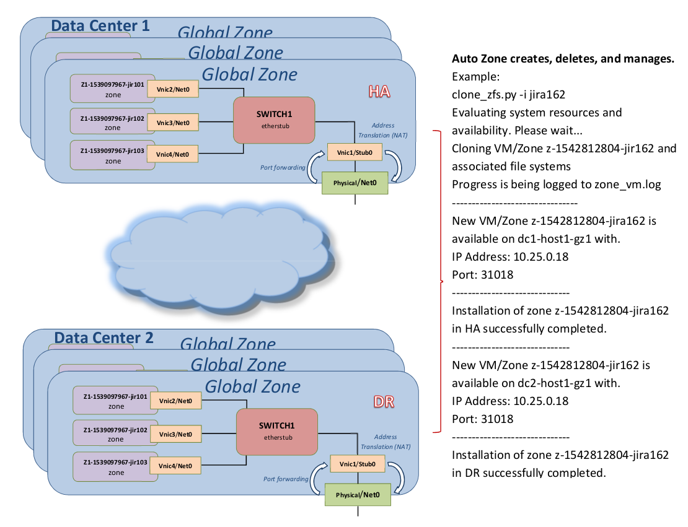

<b>Version 0.8 - Whats new</b>

<b>Added:</b> Added a new db zone type. the db zone type will not rely on zfs snapshots. to snap a new db zone, it will use snapshots for the zone, and rsync to copy the db content, the full process is outlined below.

The DB zone type is initially created like any other zone, cloned from z-source (or whatever name you specify in devops_config.ini).
You create a file called db_version.ini with a db version number (for example 1), or the system will automatically created it with the first version number.

By installing the zone you specify the type as DB with option <i>-t db</i> for the zone type.

The clone process will work as follows.
<ol>
	<li>The system create a new DB zone when you run the script with option <i>-t db</i>.</li>
	<li>At install time the system will try to find the latest DB version, and create the new DB zone with the next available version. for example if the current version is 5, it will created the new zone with version 6.</li>
	<li>At time of the zone install a new DB file system will get initialized.</li>
	<li>At first boot of the new DB zone, the zone will mount the current db version (for example version 5), and also mount the new version (for example version 6).</li>

	<li>Automatically copy all data from current version for example version <i>5</i> => to new version for example <i>6</i>.</li>
	<li>When completed, umount version 5 and version 6. re-mount version 6 as the normal db mount and start the db.</li>
</ol>

Example installing a new db zone.
<pre>
./devops_manager.py -i db105 -u usera -t db -p
Evaluating system resources availability. Please wait...
Getting latest available db version for ifxdb-do_v-.
Successfully got next version as ifxdb-do_v-5.
Cloning VM/Zone z-db-v5-1556825338-db105 and associated file systems
Progress is being logged to zone_vm.log
--------------------------------
Cloning VM/Zone z-db-v5-1556825338-db105 and associated file systems
Progress is being logged to zone_vm.log
--------------------------------
Sync to new db ifxdb-do_v-5 is in progress.. please be patient...
This can take approximately 10-15 minutes to complete.
Note: The sync is running in HA only i.e. DR will complete first with data available once HA is up.

-------========= Standby data center =========-------
        VM/Zone Name: z-db-v5-1556825338-db105
        Hostname: dc1-devops2
        Zone Port: 31018
        DB Port: 31518
        Internal IP Address: 10.25.0.18
        VM Mount source: apps1_z-source
        DB Mount source: ifxdb-do_v-5
        VM Mount destination: /apps1
        DB Mount destination: /ifxsrv
...[snip]
</pre>

Output of the updated devops_manager help script for the new option is below.
<pre>
./devops_manager.py -h
...
  -t [{app,db}], --appType [{app,db}]
                        select zone/VM type. app or db(default is app)
</pre>

By default, all new zones with type app, will get created with the current db version. the current/active db is the one specified in db_version.ini.
The version can be updated with the new <b>-n</b> option.

For example to update the current active db version you can run the below:
<pre>
/devops_manager.py -n 6 -u usera
Please enter usera's LDAP password :
Note: you are accessing this application as a: admin

Getting latest available db version for ifxdb-do_v-.
Successfully updated DB version from 5 to 6.
</pre>
Note: You need <i>admin</i> access to do so, otherwise you will get something like the message below(for more info check out the new user role section).
<pre>
./devops_manager.py -n 5 -u usera
Please enter usera's LDAP password :
Note: you are accessing this application as a: user

Getting latest available db version for ifxdb-do_v-.
Access denied.
</pre>

In addition. you can specify a DB version at zone creation or when rotating/updating the db with the <i>-r db -v 5</i> options, otherwise the current db version will be used.

<b>Added:</b> The user creating a zone will now be stored as part of an SMF property. at time of login you will get the below message (if you are not the developer created the zone).
<pre>
ssh -l USERB hosta
...
Oracle Corporation      SunOS 5.11      11.4    November 2018

----------------============= ++ =============---------------
*************** ATTENTION ATTENTION ATTENTION! **************
This virtual environment / zone was created by user:
USERA
And you are:
USERB

Please make sure this is REALLY the virtual environment you are looking for.
----------------============= ++ =============---------------
Are you sure you want to continue?
</pre>

<b>Added:</b> Two new required options ware added, <i>-u user</i> and <i>-p password</i>.
In addition. the <i>-U</i> was also added, more information is available below.
Note: for the <i>-p</i> option if you only specify <i>-p</i> without the <i>password</i> the system will prompt you for the password.

<i>Note: </i>The devops JSON database now includes the user created the zone, the database file is stored in ports.db, and might need to be manually updated.

<b>Updated:</b> The zone live status view got updated with the zones db real mount, an example is below.
<pre>
./devops_manager.py -s -u usera -i jira122
Pulling status...
------------------------------
Finding server containing zone for jira122 in DR.
Pulling status...
------------------------------
Finding server containing zone for jira122 in HA.
Found jira122 on dc1-devops2 in HA.
Found jira122 on dc2-devops2 in DR.
===============================================================
******* NOTE: Informix is only running on dc1-devops2 *******
                         (devops2)                      
===============================================================

-------========= Active data center =========-------
        VM/Zone Name: z-1556827881-jira122
        Hostname: devops2
        Zone Port: 31019
        DB Port: 31519
        Internal IP Address: 10.25.0.19
        VM Mount: /apps1
        DB Mount: /ifxsrv
        VM Mount source: /export/apps1_z-1556827881-jira122
        DB Mount source: /export/ifxdb-do_v-5-z-1556827881-jira122
...
</pre>

<b>New:</b> Rotating a VM/Zone DB file system will rotate using the db image initially used for creation.

An example rotate db is below.
<i>Note:</i> not much has changed in usage, however this was updated under the hood to accommodate the db changes (more about the at the end).
<pre>
./devops_manager.py -i jira121 -r db -u usera
Finding server containing zone for jira121 in HA.
Found jira121 on dc1-devops1 in HA.
(/ifxsrv)Rotating HA(ifxdb-do_v-5-z-1556827550-jira121) mount in zone z-1556827550-jira121.. please wait...
(/ifxsrv)Rotation of HA(ifxdb-do_v-5-z-1556827550-jira121) mount in zone z-1556827550-jira121 completed successfully.
Finding server containing zone for jira121 in DR.
Found jira121 on dc2-devops1 in DR.
(/ifxsrv)Re-mounting DR(ifxdb-do_v-5-z-1556827550-jira121) mount in zone z-1556827550-jira121.. please wait...
(/ifxsrv)Re-mount of DR(ifxdb-do_v-5-z-1556827550-jira121) mount in zone z-1556827550-jira121 completed successfully.
</pre>

<b>Added/updated:</b> The zone status was totally re-done, to include most information required(as requested by our developers), a few examples are below.

Default results for only the current authenticated user, without any options.
<pre>
./devops_manager.py -l -u usera        
Please enter usera's LDAP password :
Note: you are accessing this application as a: admin

Checking system resources. please wait...

Note: Use -a option to display all active VM/Zones....
----------------============= HA =============---------------

Global Zone:         devops1 / (dc1-devops1)
----------------============= ++ =============---------------
Please wait... while we gather information...
z-1559233309-jiraMenu5           : [------------------------->  ]92%
Active Zones:
------------------------------------------------------------
   ZONE NAME                        TYPE  VER  PORT   CREATED BY
------------------------------------------------------------
   z-db-v6-1557163375-db106         DB    v6   31018  usera     
   z-1557858367-jiraMenu            APP   v6   31015  usera     
   z-1559231863-jiraMenu3           APP   v5   31020  usera     
   z-1559233309-jiraMenu5           APP   v5   31021  usera     
-------------------------------------------------------------
   * Denotes the default(active) DB
----------------============= ++ =============---------------
... [snip]  
</pre>

Getting results for another user by adding -U userb
<pre>
./devops_manager.py -l -u usera -U userb
Please enter usera's LDAP password :
Note: you are accessing this application as a: admin

Checking system resources. please wait...

Note: Use -a option to display all active VM/Zones....
----------------============= HA =============---------------

Global Zone:         devops1 / (dc1-devops1)
----------------============= ++ =============---------------
Please wait... while we gather information...
z-1559233309-jiraMenu5           : [------------------------->  ]92%
Active Zones:
------------------------------------------------------------
   ZONE NAME                        TYPE  VER  PORT   CREATED BY
------------------------------------------------------------
   z-1555593119-migration-master    APP   N/A  31016  userb    
   z-1557156336-UNX-159412          APP   v5   31017  userb    
   z-1557175109-UNX-159411          APP   v5   31019  userb    
-------------------------------------------------------------
   * Denotes the default(active) DB
----------------============= ++ =============---------------
... [snip]
</pre>

Showing results for all zones by adding -a.
<pre>
./devops_manager.py -l -u user -a
Please enter usera's LDAP password :
Note: you are accessing this application as a: admin

Checking system resources. please wait...

----------------============= HA =============---------------

Global Zone:         devops1 / (dc1-devops1)
----------------============= ++ =============---------------
Please wait... while we gather information...
z-1559233309-jiraMenu5           : [------------------------->  ]92%
Active Zones:
------------------------------------------------------------
   ZONE NAME                        TYPE  VER  PORT   CREATED BY
------------------------------------------------------------
   z-db-source                      DB    N/A  31002  root     
   z-1551898417-jircopy020519       APP   N/A  31012  userc  
   z-1552923560-jira124             APP   N/A  31013  userc  
   z-1554480751-UNX-999             APP   N/A  31011  userc  
   z-1555593119-migration-master    APP   N/A  31016  userb    
   z-fs-source                      FS    v1   31003  root     
   z-1557156336-UNX-159412          APP   v5   31017  userb    
   z-db-v6-1557163375-db106         DB    v6   31018  usera     
   z-1557175109-UNX-159411          APP   v5   31019  userb    
   z-1557858367-jiraMenu            APP   v6   31015  usera     
   z-1559231863-jiraMenu3           APP   v5   31020  usera     
   z-1559233309-jiraMenu5           APP   v5   31021  usera     
-------------------------------------------------------------
   * Denotes the default(active) DB
----------------============= ++ =============---------------
... [snip]
</pre>

Getting the most information...(adding -l det and -a)
Note: -a for all zones, and -l det for full details.
<pre>
./devops_manager.py -l det -u usera -a
Please enter usera's LDAP password :
Note: you are accessing this application as a: admin

Checking system resources. please wait...

----------------============= HA =============---------------

Global Zone:         devops1 / (dc1-devops1)
----------------============= ++ =============---------------
Please wait... while we gather information...
z-1559233309-jiraMenu5           : [------------------------->  ]92%
Active Zones:
------------------------------------------------------------
   ZONE NAME                        TYPE  VER  PORT   CREATED BY
------------------------------------------------------------
   z-db-source                      DB    N/A  31002  root     
   z-1551898417-jircopy020519       APP   N/A  31012  userc  
   z-1552923560-jira124             APP   N/A  31013  userc  
   z-1554480751-UNX-999             APP   N/A  31011  userc  
   z-1555593119-migration-master    APP   N/A  31016  userc    
   z-fs-source                      FS    v1   31003  root     
   z-1557156336-UNX-159412          APP   v5   31017  userb    
   z-db-v6-1557163375-db106         DB    v6   31018  usera     
   z-1557175109-UNX-159411          APP   v5   31019  userb    
   z-1557858367-jiraMenu            APP   v6   31015  usera     
   z-1559231863-jiraMenu3           APP   v5   31020  usera     
   z-1559233309-jiraMenu5           APP   v5   31021  usera     
-------------------------------------------------------------
   * Denotes the default(active) DB
----------------============= ++ =============---------------
Zones Details:
------------------------------------------------------------
   ID:                               1        
   Active Zone Count:                12       
   Global Zone Free Memory:          187464 Mb
   15 Minute Load Average:           0.25     
   Current DB version:               5        
------------------------------------------------------------

Global Zone:         devops2 / (dc1-devops2)
----------------============= ++ =============---------------
Please wait... while we gather information...
z-1559232422-jiraMenu4           : [------------------------>   ]89%
Active Zones:
------------------------------------------------------------
   ZONE NAME                        TYPE  VER  PORT   CREATED BY
------------------------------------------------------------
   z-1550602019-jira103             APP   N/A  31011  userc  
   z-1550610548-jira104             APP   N/A  31012  userc  
   z-1554125109-genero-poc          APP   N/A  31014  userc  
   z-fs-source                      FS    v1   31003  root     
   z-db-v5-1556825338-db105         DB    v5*  31018  usera     
   z-1557163823-UNX-159413          APP   v5   31013  userb    
   z-1557239055-family-test         APP   v5   31015  userb    
   z-1558040749-jiraMenu2           APP   v5   31016  usera     
   z-1559232422-jiraMenu4           APP   v5   31017  usera     
-------------------------------------------------------------
   * Denotes the default(active) DB
----------------============= ++ =============---------------
Zones Details:
------------------------------------------------------------
   ID:                               2        
   Active Zone Count:                9        
   Global Zone Free Memory:          174867 Mb
   15 Minute Load Average:           0.27     
   Current DB version:               5        
------------------------------------------------------------
----------------============= DR =============---------------
</pre>

<b>Enhanced:</b> If you don't specify an argument for the -i option, the script will prompt you for one.

<b>Added:</b> Added a -v option at zone creation or at zone rotate, the -v will set which db version to install/use.

<b>Added:</b> The system now checks for user and application roles.

There are a few roles defined out of the box feel free to change them around as needed.

Below is explained how it works.
<pre>
devops_config.ini
...
[APP_ROLES]
# Define each part of the application which role required.
# roles are:
# superAdmin: 1, admin level1: 2, user: 5
delete_vm = 10
add_vm = 10
create_db = 10
rotate_app = 10
update_db_ver = 10
rotate_db = 5
</pre>

Now, you have to create a file called access.db, the file defines what access the user gets, the higher the number the more access(based on whats defined in the devops_config.ini APP_ROLES section.
<pre>
cat access.db
# Roles are specfied in devops_manager.ini
# roles are superAdmin:10, admin:9, user:5, guest:1
usera:5:user
admin1:10:superAdmin
admin2:10:superAdmin
joe:5:user
</pre>
If the user is not in the <i>access.db</i>. access will be denied.

<b>Enhancement:</b> The script will now check and make sure the devops zone/ports db is not in-use while trying to update.

<b>Version 0.7.1</b>

<b>Added: </b>Added a service state check loop, since all RAD/SMF service handles are done async, I had to add a check to make sure the service fully stopped before re-started.

<b>Version 0.7</b>

<b>Added / Enhancement: </b>This version greatly improves / simplifies all configuration modifications by using the Python <i>ConfigParser</i> module.
 With this version, all configuration details are modified in a new separate configuration file <i>devops_config.ini</i>.
<i>Note: </i>This means the Python <i>ConfigParser</i> module is now a required module.

<b>Updated: </b>The main program <i>clone_zfs.py</i> was re-named to <i>devops_manager.py</i>, for clearance.

<b>Added: </b>With this version you can enable an LDAP supported profile, by enabling LDAP support in the <i>devops_config.ini</i> configuration file.
<i>Note: </i>You can also list/specify a list of certificates to be installed at zone cloning time.

<b>Enhanced: </b>With this version you can enable NFS mount support, by enabling NFS support in the <i>devops_config.ini</i> configuration file.
 With this version, you can specify a list of NFS mounts in the <i>devops_config.ini</i> to be configured/mounted at cloning time.

<b>Added: </b>With this version you can add additional services with the <i>devops_config.ini</i> configuration file.
 With this version you can also specfy a list of file systems to be cloned.
<i>Note: </i>We are using an external databse with the configuration files stored on a ZFS appliance, being cloned at runtime.

<b>Updated: </b>This version modifies / adds to the <b>-r</b> option, you can now specify <b>-r app</b> or <b>-r db</b>
 The <b>-r db</b>, will rotate / create a new ZFS snapshot of the database mount, re-mount the file system, stop/start the DB.
<i>Note: </i>You are not required to use a database mount, this can be enabled/disabled in the <i>devops_config.ini</i> configuration file.

<b>Enhancement: </b>This version catches/fixes a number of application errors, better port allocation/releasing, etc..

<b>Added/Updated: </b>With this version a new structure was created/added a sub directory of <i>bin</i> and of <i>conf</i>
 All required files like sc_profile, LDAP certficates, SMF xml files shuld be placed in the <i>conf</i> directory, and all startup scripts shuld be placed in the <i>bin</i> directory.

<b>Version 0.6</b>

<b>Added: </b>This version adds the capability to create Zones with High Availability(HA) and Disaster Recovery(DR) in mind.

 

 <b>With this version:</b>
<ol>
<li>You can now specify a list of HA (local servers) and a list of DR (remote) servers.</li>
<li>The script will automatically select the least loaded server to create the Zone.</li>
<li>Every zone will get created in pairs, an HA(local) zone and a DR(remote) Zone (based on least load).</li>
<li>The script will also make sure there is enough resources, based on your minimum CPU, Memory, etc...</li>
</ol>

<b>Added: </b>This version adds the VM/Zone image rotate i.e. <b>-l (--listZones)</b> option.
 With this version you can now update/rollback an image using the newest ZFS copy.

<b>Added: </b>Add documentation to all Python code functions

<b>Updated: </b>This version enhances / replaces the IP / Port mapping option used in the previous version.
 With this version you don't need to create / copy the port mapping file to all zones, the controller(server that runs this script) will keep track of all zone IP / Port mappings. the script utilizes the Python <i>pickleDB</i> module to keep track of this changes, the <i>pickleDB</i> stores all modifications in a JSON like file format called <i>ports.db</i> .

<b>Updated: </b>This version enhances / simplifies and removes the need to create an sc_profile.xml.
 With this version there is no need to pre-create the sc_profile.xml, the script will dynamically create the sc_profile.xml at zone install/cloning time.

<b>Version 0.5</b>

<b>Added: </b>This version adds the VM/Zone image rotate i.e. <b>-r (--rotateImg)</b> option.
 With this version you can now update/rollback an image using the newest ZFS copy.

<i>For example:</i>
 z-12345-jir1 was created on 10/1
 Then
 z-12345-jir2 was created on 10/2
 then
 z-12345-jir3 was created on 10/3
 If you <i>remove z-12345-jir2</i> all changes/updates consume disk space eve it was deleted, it will only be freed if <i>z-12345-jir1</i> will be removed which is still in use.

To get around this issue.

You can use the option <b>-r</b> which will clone/create a new zfs file system in  <i>z-12345-jir1</i> with the prefix of <i>_clone</i>.

Next, it will copy by using <i>rsync --delete</i> to back-date the clone with the original content.

Finlay, it will switch / rename mount points and snaps.
 <i>Note: </i>Currently the original image / snap will only be renamed with a time stamp and original name,
if all checks out to be good you manually deleted the image, once this functionally is fully tested I will add to auto delete the old original image/snap.

<b>Updated: </b>With this updated the VM/Zone deleted option was also updated.
 Since you can now have multiple snaps/clones for the same VM/zone.
 If you use the <b>-d</b> option the system will remove the VM/zone as well as all associated snaps/clones.

<b>Updated: </b>Created new directory <i>cloneFiles/conf</i> and <i>cloneFiles/bin</i>, all executable files ware moved to bin and all xml ware moved to conf, the xml files ware updated with the new file path.

<b>Updated: </b>Added a service for rsync <i>application/apps1_mount:apps1sync</i>, it will look like the below.
<pre>
disabled       11:40:15 svc:/application/apps1_mount:apps1sync
disabled       11:40:15 svc:/application/apps1_mount:apps1dst
disabled       11:40:15 svc:/application/apps1_mount:apps1src
</pre>

<b>Version 0.3</b>

Added Network digram

<b>Version 0.2</b>

Added sc_profile.xml example

<b>Version 0.1</b>

Initial Release
