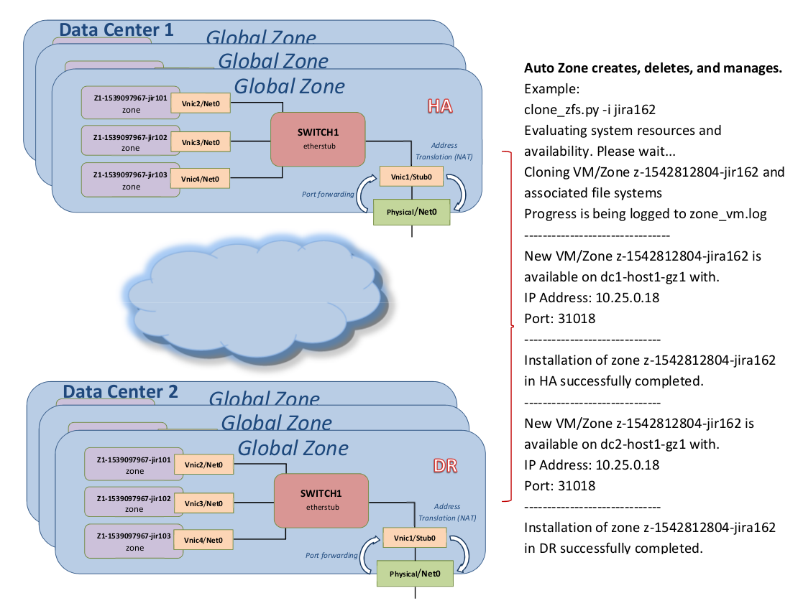
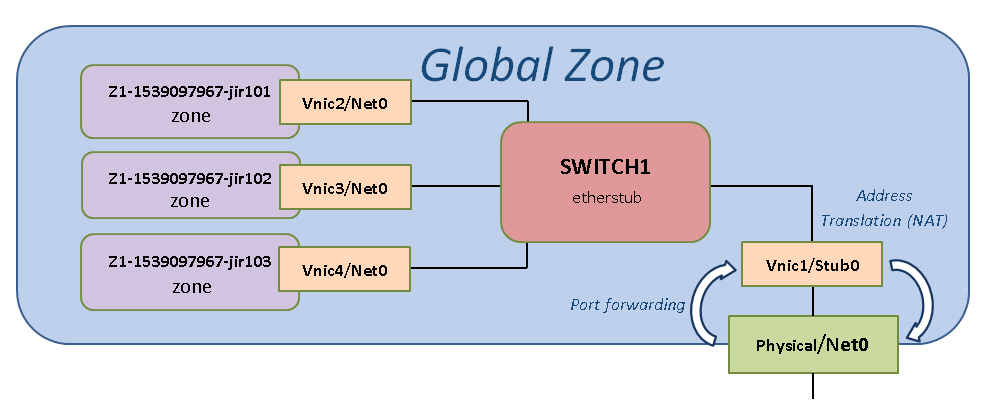

Below is described the installation and configuration process.

<ol>
    <li>On the Solaris Global Zone, will be using a private switch (etherstub) for all zones.</li>
    <li>To communicate from within the zones to the outside Lan we will be using NAT and routing/forwarding.</li>
    <li>To communicate from the out side Lan to one of the zones will be using port forwarding.
Will be using the Solaris <i>firewalld</i> application to do all that.</li>
    <li>All the cloned zones will be receiving there IP address from the global zones DHCP server.</li>
    <li>We will also create a static IP to Port mapping list so we know which port forwards to which IP address.</li>
    <li>We will be preparing all of this below.</li>
    <li>The script will then be utilizing all of this as part of the cloning process described below.</li>
</ol>

To help and better understand I created a network diagram below.
 <b>Full network diagram</b>
 

 <b>Zone network diagram</b>
 

<h4>Creating a Solaris private switch(etherstub)</h4>
Lets create a private switch (etherstub) with a local link, you do so by running the below.
<pre>
# Create switch
dladm create-etherstub etherstub0
# Create Link
dladm create-vnic -l etherstub0 stub1
# Create router ip
ipadm create-ip stub1
ipadm create-addr -a 10.25.0.1/23 stub1
</pre>
<i>Note: </i> The Ip Address of <i>10.25.0.1</i> is your router to the outside world or your local Lan.

Next, Turn on ip routing/forwarding on the new switch/etherstub.
<pre>
ipadm set-ifprop -p forwarding=on -m ipv4 stub1
</pre>
Now, lets create the firewall forwarding and NAT rules, you do so by creating the below.
cat /etc/firewall/pf.conf
<pre>
set reassemble yes no-df

set skip on lo0

# Add rules below
ext_if = "net0"    # macro for external interface - use net0 or vnic name to external
int_if = "stub1"       # macro for internal interface etherstub

# Port forward (from out side to each zone)
pass in on $ext_if proto tcp from any to any port 31002 rdr-to 10.25.0.2 port 22
pass in on $ext_if proto tcp from any to any port 31003 rdr-to 10.25.0.3 port 22
pass in on $ext_if proto tcp from any to any port 31004 rdr-to 10.25.0.4 port 22
pass in on $ext_if proto tcp from any to any port 31005 rdr-to 10.25.0.5 port 22
pass in on $ext_if proto tcp from any to any port 31006 rdr-to 10.25.0.6 port 22
pass in on $ext_if proto tcp from any to any port 31007 rdr-to 10.25.0.7 port 22
pass in on $ext_if proto tcp from any to any port 31008 rdr-to 10.25.0.8 port 22
pass in on $ext_if proto tcp from any to any port 31009 rdr-to 10.25.0.9 port 22
pass in on $ext_if proto tcp from any to any port 31010 rdr-to 10.25.0.10 port 22
pass in on $ext_if proto tcp from any to any port 31011 rdr-to 10.25.0.11 port 22
pass in on $ext_if proto tcp from any to any port 31012 rdr-to 10.25.0.12 port 22
pass in on $ext_if proto tcp from any to any port 31013 rdr-to 10.25.0.13 port 22
pass in on $ext_if proto tcp from any to any port 31014 rdr-to 10.25.0.14 port 22
pass in on $ext_if proto tcp from any to any port 31015 rdr-to 10.25.0.15 port 22
pass in on $ext_if proto tcp from any to any port 31016 rdr-to 10.25.0.16 port 22
pass in on $ext_if proto tcp from any to any port 31017 rdr-to 10.25.0.17 port 22
pass in on $ext_if proto tcp from any to any port 31018 rdr-to 10.25.0.18 port 22
pass in on $ext_if proto tcp from any to any port 31019 rdr-to 10.25.0.19 port 22
pass in on $ext_if proto tcp from any to any port 31020 rdr-to 10.25.0.20 port 22
pass in on $ext_if proto tcp from any to any port 31021 rdr-to 10.25.0.21 port 22
pass in on $ext_if proto tcp from any to any port 31022 rdr-to 10.25.0.22 port 22
pass in on $ext_if proto tcp from any to any port 31023 rdr-to 10.25.0.23 port 22
pass in on $ext_if proto tcp from any to any port 31024 rdr-to 10.25.0.24 port 22
pass in on $ext_if proto tcp from any to any port 31025 rdr-to 10.25.0.25 port 22
pass in on $ext_if proto tcp from any to any port 31026 rdr-to 10.25.0.26 port 22
pass in on $ext_if proto tcp from any to any port 31027 rdr-to 10.25.0.27 port 22
pass in on $ext_if proto tcp from any to any port 31028 rdr-to 10.25.0.28 port 22
pass in on $ext_if proto tcp from any to any port 31029 rdr-to 10.25.0.29 port 22
pass in on $ext_if proto tcp from any to any port 31030 rdr-to 10.25.0.30 port 22
pass in on $ext_if proto tcp from any to any port 31031 rdr-to 10.25.0.31 port 22
pass in on $ext_if proto tcp from any to any port 31032 rdr-to 10.25.0.32 port 22
pass in on $ext_if proto tcp from any to any port 31033 rdr-to 10.25.0.33 port 22
pass in on $ext_if proto tcp from any to any port 31034 rdr-to 10.25.0.34 port 22
pass in on $ext_if proto tcp from any to any port 31035 rdr-to 10.25.0.35 port 22
pass in on $ext_if proto tcp from any to any port 31036 rdr-to 10.25.0.36 port 22
pass in on $ext_if proto tcp from any to any port 31037 rdr-to 10.25.0.37 port 22
pass in on $ext_if proto tcp from any to any port 31038 rdr-to 10.25.0.38 port 22
pass in on $ext_if proto tcp from any to any port 31039 rdr-to 10.25.0.39 port 22
pass in on $ext_if proto tcp from any to any port 31040 rdr-to 10.25.0.40 port 22
pass in on $ext_if proto tcp from any to any port 31041 rdr-to 10.25.0.41 port 22
pass in on $ext_if proto tcp from any to any port 31042 rdr-to 10.25.0.42 port 22
pass in on $ext_if proto tcp from any to any port 31043 rdr-to 10.25.0.43 port 22
pass in on $ext_if proto tcp from any to any port 31044 rdr-to 10.25.0.44 port 22
pass in on $ext_if proto tcp from any to any port 31045 rdr-to 10.25.0.45 port 22
pass in on $ext_if proto tcp from any to any port 31046 rdr-to 10.25.0.46 port 22
pass in on $ext_if proto tcp from any to any port 31047 rdr-to 10.25.0.47 port 22
pass in on $ext_if proto tcp from any to any port 31048 rdr-to 10.25.0.48 port 22
pass in on $ext_if proto tcp from any to any port 31049 rdr-to 10.25.0.49 port 22
pass in on $ext_if proto tcp from any to any port 31050 rdr-to 10.25.0.50 port 22
pass in on $ext_if proto tcp from any to any port 31051 rdr-to 10.25.0.51 port 22
pass in on $ext_if proto tcp from any to any port 31052 rdr-to 10.25.0.52 port 22
pass in on $ext_if proto tcp from any to any port 31053 rdr-to 10.25.0.53 port 22
pass in on $ext_if proto tcp from any to any port 31054 rdr-to 10.25.0.54 port 22
pass in on $ext_if proto tcp from any to any port 31055 rdr-to 10.25.0.55 port 22
pass in on $ext_if proto tcp from any to any port 31056 rdr-to 10.25.0.56 port 22
pass in on $ext_if proto tcp from any to any port 31057 rdr-to 10.25.0.57 port 22
pass in on $ext_if proto tcp from any to any port 31058 rdr-to 10.25.0.58 port 22
pass in on $ext_if proto tcp from any to any port 31059 rdr-to 10.25.0.59 port 22
pass in on $ext_if proto tcp from any to any port 31060 rdr-to 10.25.0.60 port 22
pass in on $ext_if proto tcp from any to any port 31061 rdr-to 10.25.0.61 port 22
pass in on $ext_if proto tcp from any to any port 31062 rdr-to 10.25.0.62 port 22
pass in on $ext_if proto tcp from any to any port 31063 rdr-to 10.25.0.63 port 22
pass in on $ext_if proto tcp from any to any port 31064 rdr-to 10.25.0.64 port 22
pass in on $ext_if proto tcp from any to any port 31065 rdr-to 10.25.0.65 port 22
pass in on $ext_if proto tcp from any to any port 31066 rdr-to 10.25.0.66 port 22
pass in on $ext_if proto tcp from any to any port 31067 rdr-to 10.25.0.67 port 22
pass in on $ext_if proto tcp from any to any port 31068 rdr-to 10.25.0.68 port 22
pass in on $ext_if proto tcp from any to any port 31069 rdr-to 10.25.0.69 port 22
pass in on $ext_if proto tcp from any to any port 31070 rdr-to 10.25.0.70 port 22
pass in on $ext_if proto tcp from any to any port 31071 rdr-to 10.25.0.71 port 22
pass in on $ext_if proto tcp from any to any port 31072 rdr-to 10.25.0.72 port 22
pass in on $ext_if proto tcp from any to any port 31073 rdr-to 10.25.0.73 port 22
pass in on $ext_if proto tcp from any to any port 31074 rdr-to 10.25.0.74 port 22
pass in on $ext_if proto tcp from any to any port 31075 rdr-to 10.25.0.75 port 22
pass in on $ext_if proto tcp from any to any port 31076 rdr-to 10.25.0.76 port 22
pass in on $ext_if proto tcp from any to any port 31077 rdr-to 10.25.0.77 port 22
pass in on $ext_if proto tcp from any to any port 31078 rdr-to 10.25.0.78 port 22
pass in on $ext_if proto tcp from any to any port 31079 rdr-to 10.25.0.79 port 22
pass in on $ext_if proto tcp from any to any port 31080 rdr-to 10.25.0.80 port 22
pass in on $ext_if proto tcp from any to any port 31081 rdr-to 10.25.0.81 port 22
pass in on $ext_if proto tcp from any to any port 31082 rdr-to 10.25.0.82 port 22
pass in on $ext_if proto tcp from any to any port 31083 rdr-to 10.25.0.83 port 22
pass in on $ext_if proto tcp from any to any port 31084 rdr-to 10.25.0.84 port 22
pass in on $ext_if proto tcp from any to any port 31085 rdr-to 10.25.0.85 port 22
pass in on $ext_if proto tcp from any to any port 31086 rdr-to 10.25.0.86 port 22
pass in on $ext_if proto tcp from any to any port 31087 rdr-to 10.25.0.87 port 22
pass in on $ext_if proto tcp from any to any port 31088 rdr-to 10.25.0.88 port 22
pass in on $ext_if proto tcp from any to any port 31089 rdr-to 10.25.0.89 port 22
pass in on $ext_if proto tcp from any to any port 31090 rdr-to 10.25.0.90 port 22
pass in on $ext_if proto tcp from any to any port 31091 rdr-to 10.25.0.91 port 22
pass in on $ext_if proto tcp from any to any port 31092 rdr-to 10.25.0.92 port 22
pass in on $ext_if proto tcp from any to any port 31093 rdr-to 10.25.0.93 port 22
pass in on $ext_if proto tcp from any to any port 31094 rdr-to 10.25.0.94 port 22
pass in on $ext_if proto tcp from any to any port 31095 rdr-to 10.25.0.95 port 22
pass in on $ext_if proto tcp from any to any port 31096 rdr-to 10.25.0.96 port 22
pass in on $ext_if proto tcp from any to any port 31097 rdr-to 10.25.0.97 port 22
pass in on $ext_if proto tcp from any to any port 31098 rdr-to 10.25.0.98 port 22
pass in on $ext_if proto tcp from any to any port 31099 rdr-to 10.25.0.99 port 22
pass in on $ext_if proto tcp from any to any port 31100 rdr-to 10.25.0.100 port 22
pass in on $ext_if proto tcp from any to any port 31101 rdr-to 10.25.0.101 port 22
pass in on $ext_if proto tcp from any to any port 31102 rdr-to 10.25.0.102 port 22
pass in on $ext_if proto tcp from any to any port 31103 rdr-to 10.25.0.103 port 22
pass in on $ext_if proto tcp from any to any port 31104 rdr-to 10.25.0.104 port 22
pass in on $ext_if proto tcp from any to any port 31105 rdr-to 10.25.0.105 port 22
pass in on $ext_if proto tcp from any to any port 31106 rdr-to 10.25.0.106 port 22
pass in on $ext_if proto tcp from any to any port 31107 rdr-to 10.25.0.107 port 22
pass in on $ext_if proto tcp from any to any port 31108 rdr-to 10.25.0.108 port 22
pass in on $ext_if proto tcp from any to any port 31109 rdr-to 10.25.0.109 port 22
pass in on $ext_if proto tcp from any to any port 31110 rdr-to 10.25.0.110 port 22
pass in on $ext_if proto tcp from any to any port 31111 rdr-to 10.25.0.111 port 22
pass in on $ext_if proto tcp from any to any port 31112 rdr-to 10.25.0.112 port 22
pass in on $ext_if proto tcp from any to any port 31113 rdr-to 10.25.0.113 port 22
pass in on $ext_if proto tcp from any to any port 31114 rdr-to 10.25.0.114 port 22
pass in on $ext_if proto tcp from any to any port 31115 rdr-to 10.25.0.115 port 22
pass in on $ext_if proto tcp from any to any port 31116 rdr-to 10.25.0.116 port 22
pass in on $ext_if proto tcp from any to any port 31117 rdr-to 10.25.0.117 port 22
pass in on $ext_if proto tcp from any to any port 31118 rdr-to 10.25.0.118 port 22
pass in on $ext_if proto tcp from any to any port 31119 rdr-to 10.25.0.119 port 22
pass in on $ext_if proto tcp from any to any port 31120 rdr-to 10.25.0.120 port 22
pass in on $ext_if proto tcp from any to any port 31121 rdr-to 10.25.0.121 port 22
pass in on $ext_if proto tcp from any to any port 31122 rdr-to 10.25.0.122 port 22
pass in on $ext_if proto tcp from any to any port 31123 rdr-to 10.25.0.123 port 22
pass in on $ext_if proto tcp from any to any port 31124 rdr-to 10.25.0.124 port 22
pass in on $ext_if proto tcp from any to any port 31125 rdr-to 10.25.0.125 port 22
pass in on $ext_if proto tcp from any to any port 31126 rdr-to 10.25.0.126 port 22
pass in on $ext_if proto tcp from any to any port 31127 rdr-to 10.25.0.127 port 22
pass in on $ext_if proto tcp from any to any port 31128 rdr-to 10.25.0.128 port 22
pass in on $ext_if proto tcp from any to any port 31129 rdr-to 10.25.0.129 port 22
pass in on $ext_if proto tcp from any to any port 31130 rdr-to 10.25.0.130 port 22
pass in on $ext_if proto tcp from any to any port 31131 rdr-to 10.25.0.131 port 22
pass in on $ext_if proto tcp from any to any port 31132 rdr-to 10.25.0.132 port 22
pass in on $ext_if proto tcp from any to any port 31133 rdr-to 10.25.0.133 port 22
pass in on $ext_if proto tcp from any to any port 31134 rdr-to 10.25.0.134 port 22
pass in on $ext_if proto tcp from any to any port 31135 rdr-to 10.25.0.135 port 22
pass in on $ext_if proto tcp from any to any port 31136 rdr-to 10.25.0.136 port 22
pass in on $ext_if proto tcp from any to any port 31137 rdr-to 10.25.0.137 port 22
pass in on $ext_if proto tcp from any to any port 31138 rdr-to 10.25.0.138 port 22
pass in on $ext_if proto tcp from any to any port 31139 rdr-to 10.25.0.139 port 22
pass in on $ext_if proto tcp from any to any port 31140 rdr-to 10.25.0.140 port 22
pass in on $ext_if proto tcp from any to any port 31141 rdr-to 10.25.0.141 port 22
pass in on $ext_if proto tcp from any to any port 31142 rdr-to 10.25.0.142 port 22
pass in on $ext_if proto tcp from any to any port 31143 rdr-to 10.25.0.143 port 22
pass in on $ext_if proto tcp from any to any port 31144 rdr-to 10.25.0.144 port 22
pass in on $ext_if proto tcp from any to any port 31145 rdr-to 10.25.0.145 port 22
pass in on $ext_if proto tcp from any to any port 31146 rdr-to 10.25.0.146 port 22
pass in on $ext_if proto tcp from any to any port 31147 rdr-to 10.25.0.147 port 22
pass in on $ext_if proto tcp from any to any port 31148 rdr-to 10.25.0.148 port 22
pass in on $ext_if proto tcp from any to any port 31149 rdr-to 10.25.0.149 port 22
pass in on $ext_if proto tcp from any to any port 31150 rdr-to 10.25.0.150 port 22
pass in on $ext_if proto tcp from any to any port 31151 rdr-to 10.25.0.151 port 22
pass in on $ext_if proto tcp from any to any port 31152 rdr-to 10.25.0.152 port 22
pass in on $ext_if proto tcp from any to any port 31153 rdr-to 10.25.0.153 port 22
pass in on $ext_if proto tcp from any to any port 31154 rdr-to 10.25.0.154 port 22
pass in on $ext_if proto tcp from any to any port 31155 rdr-to 10.25.0.155 port 22
pass in on $ext_if proto tcp from any to any port 31156 rdr-to 10.25.0.156 port 22
pass in on $ext_if proto tcp from any to any port 31157 rdr-to 10.25.0.157 port 22
pass in on $ext_if proto tcp from any to any port 31158 rdr-to 10.25.0.158 port 22
pass in on $ext_if proto tcp from any to any port 31159 rdr-to 10.25.0.159 port 22
pass in on $ext_if proto tcp from any to any port 31160 rdr-to 10.25.0.160 port 22
pass in on $ext_if proto tcp from any to any port 31161 rdr-to 10.25.0.161 port 22
pass in on $ext_if proto tcp from any to any port 31162 rdr-to 10.25.0.162 port 22
pass in on $ext_if proto tcp from any to any port 31163 rdr-to 10.25.0.163 port 22
pass in on $ext_if proto tcp from any to any port 31164 rdr-to 10.25.0.164 port 22
pass in on $ext_if proto tcp from any to any port 31165 rdr-to 10.25.0.165 port 22
pass in on $ext_if proto tcp from any to any port 31166 rdr-to 10.25.0.166 port 22
pass in on $ext_if proto tcp from any to any port 31167 rdr-to 10.25.0.167 port 22
pass in on $ext_if proto tcp from any to any port 31168 rdr-to 10.25.0.168 port 22
pass in on $ext_if proto tcp from any to any port 31169 rdr-to 10.25.0.169 port 22
pass in on $ext_if proto tcp from any to any port 31170 rdr-to 10.25.0.170 port 22
pass in on $ext_if proto tcp from any to any port 31171 rdr-to 10.25.0.171 port 22
pass in on $ext_if proto tcp from any to any port 31172 rdr-to 10.25.0.172 port 22
pass in on $ext_if proto tcp from any to any port 31173 rdr-to 10.25.0.173 port 22
pass in on $ext_if proto tcp from any to any port 31174 rdr-to 10.25.0.174 port 22
pass in on $ext_if proto tcp from any to any port 31175 rdr-to 10.25.0.175 port 22
pass in on $ext_if proto tcp from any to any port 31176 rdr-to 10.25.0.176 port 22
pass in on $ext_if proto tcp from any to any port 31177 rdr-to 10.25.0.177 port 22
pass in on $ext_if proto tcp from any to any port 31178 rdr-to 10.25.0.178 port 22
pass in on $ext_if proto tcp from any to any port 31179 rdr-to 10.25.0.179 port 22
pass in on $ext_if proto tcp from any to any port 31180 rdr-to 10.25.0.180 port 22
pass in on $ext_if proto tcp from any to any port 31181 rdr-to 10.25.0.181 port 22
pass in on $ext_if proto tcp from any to any port 31182 rdr-to 10.25.0.182 port 22
pass in on $ext_if proto tcp from any to any port 31183 rdr-to 10.25.0.183 port 22
pass in on $ext_if proto tcp from any to any port 31184 rdr-to 10.25.0.184 port 22
pass in on $ext_if proto tcp from any to any port 31185 rdr-to 10.25.0.185 port 22
pass in on $ext_if proto tcp from any to any port 31186 rdr-to 10.25.0.186 port 22
pass in on $ext_if proto tcp from any to any port 31187 rdr-to 10.25.0.187 port 22
pass in on $ext_if proto tcp from any to any port 31188 rdr-to 10.25.0.188 port 22
pass in on $ext_if proto tcp from any to any port 31189 rdr-to 10.25.0.189 port 22
pass in on $ext_if proto tcp from any to any port 31190 rdr-to 10.25.0.190 port 22
pass in on $ext_if proto tcp from any to any port 31191 rdr-to 10.25.0.191 port 22
pass in on $ext_if proto tcp from any to any port 31192 rdr-to 10.25.0.192 port 22
pass in on $ext_if proto tcp from any to any port 31193 rdr-to 10.25.0.193 port 22
pass in on $ext_if proto tcp from any to any port 31194 rdr-to 10.25.0.194 port 22
pass in on $ext_if proto tcp from any to any port 31195 rdr-to 10.25.0.195 port 22
pass in on $ext_if proto tcp from any to any port 31196 rdr-to 10.25.0.196 port 22
pass in on $ext_if proto tcp from any to any port 31197 rdr-to 10.25.0.197 port 22
pass in on $ext_if proto tcp from any to any port 31198 rdr-to 10.25.0.198 port 22
pass in on $ext_if proto tcp from any to any port 31199 rdr-to 10.25.0.199 port 22
pass in on $ext_if proto tcp from any to any port 31200 rdr-to 10.25.0.200 port 22
pass in on $ext_if proto tcp from any to any port 31201 rdr-to 10.25.0.201 port 22
pass in on $ext_if proto tcp from any to any port 31202 rdr-to 10.25.0.202 port 22
pass in on $ext_if proto tcp from any to any port 31203 rdr-to 10.25.0.203 port 22
pass in on $ext_if proto tcp from any to any port 31204 rdr-to 10.25.0.204 port 22
pass in on $ext_if proto tcp from any to any port 31205 rdr-to 10.25.0.205 port 22
pass in on $ext_if proto tcp from any to any port 31206 rdr-to 10.25.0.206 port 22
pass in on $ext_if proto tcp from any to any port 31207 rdr-to 10.25.0.207 port 22
pass in on $ext_if proto tcp from any to any port 31208 rdr-to 10.25.0.208 port 22
pass in on $ext_if proto tcp from any to any port 31209 rdr-to 10.25.0.209 port 22
pass in on $ext_if proto tcp from any to any port 31210 rdr-to 10.25.0.210 port 22
pass in on $ext_if proto tcp from any to any port 31211 rdr-to 10.25.0.211 port 22
pass in on $ext_if proto tcp from any to any port 31212 rdr-to 10.25.0.212 port 22
pass in on $ext_if proto tcp from any to any port 31213 rdr-to 10.25.0.213 port 22
pass in on $ext_if proto tcp from any to any port 31214 rdr-to 10.25.0.214 port 22
pass in on $ext_if proto tcp from any to any port 31215 rdr-to 10.25.0.215 port 22
pass in on $ext_if proto tcp from any to any port 31216 rdr-to 10.25.0.216 port 22
pass in on $ext_if proto tcp from any to any port 31217 rdr-to 10.25.0.217 port 22
pass in on $ext_if proto tcp from any to any port 31218 rdr-to 10.25.0.218 port 22
pass in on $ext_if proto tcp from any to any port 31219 rdr-to 10.25.0.219 port 22
pass in on $ext_if proto tcp from any to any port 31220 rdr-to 10.25.0.220 port 22
pass in on $ext_if proto tcp from any to any port 31221 rdr-to 10.25.0.221 port 22
pass in on $ext_if proto tcp from any to any port 31222 rdr-to 10.25.0.222 port 22
pass in on $ext_if proto tcp from any to any port 31223 rdr-to 10.25.0.223 port 22
pass in on $ext_if proto tcp from any to any port 31224 rdr-to 10.25.0.224 port 22
pass in on $ext_if proto tcp from any to any port 31225 rdr-to 10.25.0.225 port 22
pass in on $ext_if proto tcp from any to any port 31226 rdr-to 10.25.0.226 port 22
pass in on $ext_if proto tcp from any to any port 31227 rdr-to 10.25.0.227 port 22
pass in on $ext_if proto tcp from any to any port 31228 rdr-to 10.25.0.228 port 22
pass in on $ext_if proto tcp from any to any port 31229 rdr-to 10.25.0.229 port 22
pass in on $ext_if proto tcp from any to any port 31230 rdr-to 10.25.0.230 port 22
pass in on $ext_if proto tcp from any to any port 31231 rdr-to 10.25.0.231 port 22
pass in on $ext_if proto tcp from any to any port 31232 rdr-to 10.25.0.232 port 22
pass in on $ext_if proto tcp from any to any port 31233 rdr-to 10.25.0.233 port 22
pass in on $ext_if proto tcp from any to any port 31234 rdr-to 10.25.0.234 port 22
pass in on $ext_if proto tcp from any to any port 31235 rdr-to 10.25.0.235 port 22
pass in on $ext_if proto tcp from any to any port 31236 rdr-to 10.25.0.236 port 22
pass in on $ext_if proto tcp from any to any port 31237 rdr-to 10.25.0.237 port 22
pass in on $ext_if proto tcp from any to any port 31238 rdr-to 10.25.0.238 port 22
pass in on $ext_if proto tcp from any to any port 31239 rdr-to 10.25.0.239 port 22
pass in on $ext_if proto tcp from any to any port 31240 rdr-to 10.25.0.240 port 22
pass in on $ext_if proto tcp from any to any port 31241 rdr-to 10.25.0.241 port 22
pass in on $ext_if proto tcp from any to any port 31242 rdr-to 10.25.0.242 port 22
pass in on $ext_if proto tcp from any to any port 31243 rdr-to 10.25.0.243 port 22
pass in on $ext_if proto tcp from any to any port 31244 rdr-to 10.25.0.244 port 22
pass in on $ext_if proto tcp from any to any port 31245 rdr-to 10.25.0.245 port 22
pass in on $ext_if proto tcp from any to any port 31246 rdr-to 10.25.0.246 port 22
pass in on $ext_if proto tcp from any to any port 31247 rdr-to 10.25.0.247 port 22
pass in on $ext_if proto tcp from any to any port 31248 rdr-to 10.25.0.248 port 22
pass in on $ext_if proto tcp from any to any port 31249 rdr-to 10.25.0.249 port 22
pass in on $ext_if proto tcp from any to any port 31250 rdr-to 10.25.0.250 port 22
pass in on $ext_if proto tcp from any to any port 31251 rdr-to 10.25.0.251 port 22
pass in on $ext_if proto tcp from any to any port 31252 rdr-to 10.25.0.252 port 22
pass in on $ext_if proto tcp from any to any port 31253 rdr-to 10.25.0.253 port 22
pass in on $ext_if proto tcp from any to any port 31254 rdr-to 10.25.0.254 port 22
pass in on $ext_if proto tcp from any to any port 31255 rdr-to 10.25.0.255 port 22
pass in on $ext_if proto tcp from any to any port 32001 rdr-to 10.25.1.1 port 22
pass in on $ext_if proto tcp from any to any port 32002 rdr-to 10.25.1.2 port 22
pass in on $ext_if proto tcp from any to any port 32003 rdr-to 10.25.1.3 port 22
pass in on $ext_if proto tcp from any to any port 32004 rdr-to 10.25.1.4 port 22
pass in on $ext_if proto tcp from any to any port 32005 rdr-to 10.25.1.5 port 22
pass in on $ext_if proto tcp from any to any port 32006 rdr-to 10.25.1.6 port 22
pass in on $ext_if proto tcp from any to any port 32007 rdr-to 10.25.1.7 port 22
pass in on $ext_if proto tcp from any to any port 32008 rdr-to 10.25.1.8 port 22
pass in on $ext_if proto tcp from any to any port 32009 rdr-to 10.25.1.9 port 22
pass in on $ext_if proto tcp from any to any port 32010 rdr-to 10.25.1.10 port 22
pass in on $ext_if proto tcp from any to any port 32011 rdr-to 10.25.1.11 port 22
pass in on $ext_if proto tcp from any to any port 32012 rdr-to 10.25.1.12 port 22
pass in on $ext_if proto tcp from any to any port 32013 rdr-to 10.25.1.13 port 22
pass in on $ext_if proto tcp from any to any port 32014 rdr-to 10.25.1.14 port 22
pass in on $ext_if proto tcp from any to any port 32015 rdr-to 10.25.1.15 port 22
pass in on $ext_if proto tcp from any to any port 32016 rdr-to 10.25.1.16 port 22
pass in on $ext_if proto tcp from any to any port 32017 rdr-to 10.25.1.17 port 22
pass in on $ext_if proto tcp from any to any port 32018 rdr-to 10.25.1.18 port 22
pass in on $ext_if proto tcp from any to any port 32019 rdr-to 10.25.1.19 port 22
pass in on $ext_if proto tcp from any to any port 32020 rdr-to 10.25.1.20 port 22
pass in on $ext_if proto tcp from any to any port 32021 rdr-to 10.25.1.21 port 22
pass in on $ext_if proto tcp from any to any port 32022 rdr-to 10.25.1.22 port 22
pass in on $ext_if proto tcp from any to any port 32023 rdr-to 10.25.1.23 port 22
pass in on $ext_if proto tcp from any to any port 32024 rdr-to 10.25.1.24 port 22
pass in on $ext_if proto tcp from any to any port 32025 rdr-to 10.25.1.25 port 22
pass in on $ext_if proto tcp from any to any port 32026 rdr-to 10.25.1.26 port 22
pass in on $ext_if proto tcp from any to any port 32027 rdr-to 10.25.1.27 port 22
pass in on $ext_if proto tcp from any to any port 32028 rdr-to 10.25.1.28 port 22
pass in on $ext_if proto tcp from any to any port 32029 rdr-to 10.25.1.29 port 22
pass in on $ext_if proto tcp from any to any port 32030 rdr-to 10.25.1.30 port 22
pass in on $ext_if proto tcp from any to any port 32031 rdr-to 10.25.1.31 port 22
pass in on $ext_if proto tcp from any to any port 32032 rdr-to 10.25.1.32 port 22
pass in on $ext_if proto tcp from any to any port 32033 rdr-to 10.25.1.33 port 22
pass in on $ext_if proto tcp from any to any port 32034 rdr-to 10.25.1.34 port 22
pass in on $ext_if proto tcp from any to any port 32035 rdr-to 10.25.1.35 port 22
pass in on $ext_if proto tcp from any to any port 32036 rdr-to 10.25.1.36 port 22
pass in on $ext_if proto tcp from any to any port 32037 rdr-to 10.25.1.37 port 22
pass in on $ext_if proto tcp from any to any port 32038 rdr-to 10.25.1.38 port 22
pass in on $ext_if proto tcp from any to any port 32039 rdr-to 10.25.1.39 port 22
pass in on $ext_if proto tcp from any to any port 32040 rdr-to 10.25.1.40 port 22
pass in on $ext_if proto tcp from any to any port 32041 rdr-to 10.25.1.41 port 22
pass in on $ext_if proto tcp from any to any port 32042 rdr-to 10.25.1.42 port 22
pass in on $ext_if proto tcp from any to any port 32043 rdr-to 10.25.1.43 port 22
pass in on $ext_if proto tcp from any to any port 32044 rdr-to 10.25.1.44 port 22
pass in on $ext_if proto tcp from any to any port 32045 rdr-to 10.25.1.45 port 22
pass in on $ext_if proto tcp from any to any port 32046 rdr-to 10.25.1.46 port 22
pass in on $ext_if proto tcp from any to any port 32047 rdr-to 10.25.1.47 port 22
pass in on $ext_if proto tcp from any to any port 32048 rdr-to 10.25.1.48 port 22
pass in on $ext_if proto tcp from any to any port 32049 rdr-to 10.25.1.49 port 22
pass in on $ext_if proto tcp from any to any port 32050 rdr-to 10.25.1.50 port 22
pass in on $ext_if proto tcp from any to any port 32051 rdr-to 10.25.1.51 port 22
pass in on $ext_if proto tcp from any to any port 32052 rdr-to 10.25.1.52 port 22
pass in on $ext_if proto tcp from any to any port 32053 rdr-to 10.25.1.53 port 22
pass in on $ext_if proto tcp from any to any port 32054 rdr-to 10.25.1.54 port 22
pass in on $ext_if proto tcp from any to any port 32055 rdr-to 10.25.1.55 port 22
pass in on $ext_if proto tcp from any to any port 32056 rdr-to 10.25.1.56 port 22
pass in on $ext_if proto tcp from any to any port 32057 rdr-to 10.25.1.57 port 22
pass in on $ext_if proto tcp from any to any port 32058 rdr-to 10.25.1.58 port 22
pass in on $ext_if proto tcp from any to any port 32059 rdr-to 10.25.1.59 port 22
pass in on $ext_if proto tcp from any to any port 32060 rdr-to 10.25.1.60 port 22
pass in on $ext_if proto tcp from any to any port 32061 rdr-to 10.25.1.61 port 22
pass in on $ext_if proto tcp from any to any port 32062 rdr-to 10.25.1.62 port 22
pass in on $ext_if proto tcp from any to any port 32063 rdr-to 10.25.1.63 port 22
pass in on $ext_if proto tcp from any to any port 32064 rdr-to 10.25.1.64 port 22
pass in on $ext_if proto tcp from any to any port 32065 rdr-to 10.25.1.65 port 22
pass in on $ext_if proto tcp from any to any port 32066 rdr-to 10.25.1.66 port 22
pass in on $ext_if proto tcp from any to any port 32067 rdr-to 10.25.1.67 port 22
pass in on $ext_if proto tcp from any to any port 32068 rdr-to 10.25.1.68 port 22
pass in on $ext_if proto tcp from any to any port 32069 rdr-to 10.25.1.69 port 22
pass in on $ext_if proto tcp from any to any port 32070 rdr-to 10.25.1.70 port 22
pass in on $ext_if proto tcp from any to any port 32071 rdr-to 10.25.1.71 port 22
pass in on $ext_if proto tcp from any to any port 32072 rdr-to 10.25.1.72 port 22
pass in on $ext_if proto tcp from any to any port 32073 rdr-to 10.25.1.73 port 22
pass in on $ext_if proto tcp from any to any port 32074 rdr-to 10.25.1.74 port 22
pass in on $ext_if proto tcp from any to any port 32075 rdr-to 10.25.1.75 port 22
pass in on $ext_if proto tcp from any to any port 32076 rdr-to 10.25.1.76 port 22
pass in on $ext_if proto tcp from any to any port 32077 rdr-to 10.25.1.77 port 22
pass in on $ext_if proto tcp from any to any port 32078 rdr-to 10.25.1.78 port 22
pass in on $ext_if proto tcp from any to any port 32079 rdr-to 10.25.1.79 port 22
pass in on $ext_if proto tcp from any to any port 32080 rdr-to 10.25.1.80 port 22
pass in on $ext_if proto tcp from any to any port 32081 rdr-to 10.25.1.81 port 22
pass in on $ext_if proto tcp from any to any port 32082 rdr-to 10.25.1.82 port 22
pass in on $ext_if proto tcp from any to any port 32083 rdr-to 10.25.1.83 port 22
pass in on $ext_if proto tcp from any to any port 32084 rdr-to 10.25.1.84 port 22
pass in on $ext_if proto tcp from any to any port 32085 rdr-to 10.25.1.85 port 22
pass in on $ext_if proto tcp from any to any port 32086 rdr-to 10.25.1.86 port 22
pass in on $ext_if proto tcp from any to any port 32087 rdr-to 10.25.1.87 port 22
pass in on $ext_if proto tcp from any to any port 32088 rdr-to 10.25.1.88 port 22
pass in on $ext_if proto tcp from any to any port 32089 rdr-to 10.25.1.89 port 22
pass in on $ext_if proto tcp from any to any port 32090 rdr-to 10.25.1.90 port 22
pass in on $ext_if proto tcp from any to any port 32091 rdr-to 10.25.1.91 port 22
pass in on $ext_if proto tcp from any to any port 32092 rdr-to 10.25.1.92 port 22
pass in on $ext_if proto tcp from any to any port 32093 rdr-to 10.25.1.93 port 22
pass in on $ext_if proto tcp from any to any port 32094 rdr-to 10.25.1.94 port 22
pass in on $ext_if proto tcp from any to any port 32095 rdr-to 10.25.1.95 port 22
pass in on $ext_if proto tcp from any to any port 32096 rdr-to 10.25.1.96 port 22
pass in on $ext_if proto tcp from any to any port 32097 rdr-to 10.25.1.97 port 22
pass in on $ext_if proto tcp from any to any port 32098 rdr-to 10.25.1.98 port 22
pass in on $ext_if proto tcp from any to any port 32099 rdr-to 10.25.1.99 port 22
pass in on $ext_if proto tcp from any to any port 32100 rdr-to 10.25.1.100 port 22
pass in on $ext_if proto tcp from any to any port 32101 rdr-to 10.25.1.101 port 22
pass in on $ext_if proto tcp from any to any port 32102 rdr-to 10.25.1.102 port 22
pass in on $ext_if proto tcp from any to any port 32103 rdr-to 10.25.1.103 port 22
pass in on $ext_if proto tcp from any to any port 32104 rdr-to 10.25.1.104 port 22
pass in on $ext_if proto tcp from any to any port 32105 rdr-to 10.25.1.105 port 22
pass in on $ext_if proto tcp from any to any port 32106 rdr-to 10.25.1.106 port 22
pass in on $ext_if proto tcp from any to any port 32107 rdr-to 10.25.1.107 port 22
pass in on $ext_if proto tcp from any to any port 32108 rdr-to 10.25.1.108 port 22
pass in on $ext_if proto tcp from any to any port 32109 rdr-to 10.25.1.109 port 22
pass in on $ext_if proto tcp from any to any port 32110 rdr-to 10.25.1.110 port 22
pass in on $ext_if proto tcp from any to any port 32111 rdr-to 10.25.1.111 port 22
pass in on $ext_if proto tcp from any to any port 32112 rdr-to 10.25.1.112 port 22
pass in on $ext_if proto tcp from any to any port 32113 rdr-to 10.25.1.113 port 22
pass in on $ext_if proto tcp from any to any port 32114 rdr-to 10.25.1.114 port 22
pass in on $ext_if proto tcp from any to any port 32115 rdr-to 10.25.1.115 port 22
pass in on $ext_if proto tcp from any to any port 32116 rdr-to 10.25.1.116 port 22
pass in on $ext_if proto tcp from any to any port 32117 rdr-to 10.25.1.117 port 22
pass in on $ext_if proto tcp from any to any port 32118 rdr-to 10.25.1.118 port 22
pass in on $ext_if proto tcp from any to any port 32119 rdr-to 10.25.1.119 port 22
pass in on $ext_if proto tcp from any to any port 32120 rdr-to 10.25.1.120 port 22
pass in on $ext_if proto tcp from any to any port 32121 rdr-to 10.25.1.121 port 22
pass in on $ext_if proto tcp from any to any port 32122 rdr-to 10.25.1.122 port 22
pass in on $ext_if proto tcp from any to any port 32123 rdr-to 10.25.1.123 port 22
pass in on $ext_if proto tcp from any to any port 32124 rdr-to 10.25.1.124 port 22
pass in on $ext_if proto tcp from any to any port 32125 rdr-to 10.25.1.125 port 22
pass in on $ext_if proto tcp from any to any port 32126 rdr-to 10.25.1.126 port 22
pass in on $ext_if proto tcp from any to any port 32127 rdr-to 10.25.1.127 port 22
pass in on $ext_if proto tcp from any to any port 32128 rdr-to 10.25.1.128 port 22
pass in on $ext_if proto tcp from any to any port 32129 rdr-to 10.25.1.129 port 22
pass in on $ext_if proto tcp from any to any port 32130 rdr-to 10.25.1.130 port 22
pass in on $ext_if proto tcp from any to any port 32131 rdr-to 10.25.1.131 port 22
pass in on $ext_if proto tcp from any to any port 32132 rdr-to 10.25.1.132 port 22
pass in on $ext_if proto tcp from any to any port 32133 rdr-to 10.25.1.133 port 22
pass in on $ext_if proto tcp from any to any port 32134 rdr-to 10.25.1.134 port 22
pass in on $ext_if proto tcp from any to any port 32135 rdr-to 10.25.1.135 port 22
pass in on $ext_if proto tcp from any to any port 32136 rdr-to 10.25.1.136 port 22
pass in on $ext_if proto tcp from any to any port 32137 rdr-to 10.25.1.137 port 22
pass in on $ext_if proto tcp from any to any port 32138 rdr-to 10.25.1.138 port 22
pass in on $ext_if proto tcp from any to any port 32139 rdr-to 10.25.1.139 port 22
pass in on $ext_if proto tcp from any to any port 32140 rdr-to 10.25.1.140 port 22
pass in on $ext_if proto tcp from any to any port 32141 rdr-to 10.25.1.141 port 22
pass in on $ext_if proto tcp from any to any port 32142 rdr-to 10.25.1.142 port 22
pass in on $ext_if proto tcp from any to any port 32143 rdr-to 10.25.1.143 port 22
pass in on $ext_if proto tcp from any to any port 32144 rdr-to 10.25.1.144 port 22
pass in on $ext_if proto tcp from any to any port 32145 rdr-to 10.25.1.145 port 22
pass in on $ext_if proto tcp from any to any port 32146 rdr-to 10.25.1.146 port 22
pass in on $ext_if proto tcp from any to any port 32147 rdr-to 10.25.1.147 port 22
pass in on $ext_if proto tcp from any to any port 32148 rdr-to 10.25.1.148 port 22
pass in on $ext_if proto tcp from any to any port 32149 rdr-to 10.25.1.149 port 22
pass in on $ext_if proto tcp from any to any port 32150 rdr-to 10.25.1.150 port 22
pass in on $ext_if proto tcp from any to any port 32151 rdr-to 10.25.1.151 port 22
pass in on $ext_if proto tcp from any to any port 32152 rdr-to 10.25.1.152 port 22
pass in on $ext_if proto tcp from any to any port 32153 rdr-to 10.25.1.153 port 22
pass in on $ext_if proto tcp from any to any port 32154 rdr-to 10.25.1.154 port 22
pass in on $ext_if proto tcp from any to any port 32155 rdr-to 10.25.1.155 port 22
pass in on $ext_if proto tcp from any to any port 32156 rdr-to 10.25.1.156 port 22
pass in on $ext_if proto tcp from any to any port 32157 rdr-to 10.25.1.157 port 22
pass in on $ext_if proto tcp from any to any port 32158 rdr-to 10.25.1.158 port 22
pass in on $ext_if proto tcp from any to any port 32159 rdr-to 10.25.1.159 port 22
pass in on $ext_if proto tcp from any to any port 32160 rdr-to 10.25.1.160 port 22
pass in on $ext_if proto tcp from any to any port 32161 rdr-to 10.25.1.161 port 22
pass in on $ext_if proto tcp from any to any port 32162 rdr-to 10.25.1.162 port 22
pass in on $ext_if proto tcp from any to any port 32163 rdr-to 10.25.1.163 port 22
pass in on $ext_if proto tcp from any to any port 32164 rdr-to 10.25.1.164 port 22
pass in on $ext_if proto tcp from any to any port 32165 rdr-to 10.25.1.165 port 22
pass in on $ext_if proto tcp from any to any port 32166 rdr-to 10.25.1.166 port 22
pass in on $ext_if proto tcp from any to any port 32167 rdr-to 10.25.1.167 port 22
pass in on $ext_if proto tcp from any to any port 32168 rdr-to 10.25.1.168 port 22
pass in on $ext_if proto tcp from any to any port 32169 rdr-to 10.25.1.169 port 22
pass in on $ext_if proto tcp from any to any port 32170 rdr-to 10.25.1.170 port 22
pass in on $ext_if proto tcp from any to any port 32171 rdr-to 10.25.1.171 port 22
pass in on $ext_if proto tcp from any to any port 32172 rdr-to 10.25.1.172 port 22
pass in on $ext_if proto tcp from any to any port 32173 rdr-to 10.25.1.173 port 22
pass in on $ext_if proto tcp from any to any port 32174 rdr-to 10.25.1.174 port 22
pass in on $ext_if proto tcp from any to any port 32175 rdr-to 10.25.1.175 port 22
pass in on $ext_if proto tcp from any to any port 32176 rdr-to 10.25.1.176 port 22
pass in on $ext_if proto tcp from any to any port 32177 rdr-to 10.25.1.177 port 22
pass in on $ext_if proto tcp from any to any port 32178 rdr-to 10.25.1.178 port 22
pass in on $ext_if proto tcp from any to any port 32179 rdr-to 10.25.1.179 port 22
pass in on $ext_if proto tcp from any to any port 32180 rdr-to 10.25.1.180 port 22
pass in on $ext_if proto tcp from any to any port 32181 rdr-to 10.25.1.181 port 22
pass in on $ext_if proto tcp from any to any port 32182 rdr-to 10.25.1.182 port 22
pass in on $ext_if proto tcp from any to any port 32183 rdr-to 10.25.1.183 port 22
pass in on $ext_if proto tcp from any to any port 32184 rdr-to 10.25.1.184 port 22
pass in on $ext_if proto tcp from any to any port 32185 rdr-to 10.25.1.185 port 22
pass in on $ext_if proto tcp from any to any port 32186 rdr-to 10.25.1.186 port 22
pass in on $ext_if proto tcp from any to any port 32187 rdr-to 10.25.1.187 port 22
pass in on $ext_if proto tcp from any to any port 32188 rdr-to 10.25.1.188 port 22
pass in on $ext_if proto tcp from any to any port 32189 rdr-to 10.25.1.189 port 22
pass in on $ext_if proto tcp from any to any port 32190 rdr-to 10.25.1.190 port 22
pass in on $ext_if proto tcp from any to any port 32191 rdr-to 10.25.1.191 port 22
pass in on $ext_if proto tcp from any to any port 32192 rdr-to 10.25.1.192 port 22
pass in on $ext_if proto tcp from any to any port 32193 rdr-to 10.25.1.193 port 22
pass in on $ext_if proto tcp from any to any port 32194 rdr-to 10.25.1.194 port 22
pass in on $ext_if proto tcp from any to any port 32195 rdr-to 10.25.1.195 port 22
pass in on $ext_if proto tcp from any to any port 32196 rdr-to 10.25.1.196 port 22
pass in on $ext_if proto tcp from any to any port 32197 rdr-to 10.25.1.197 port 22
pass in on $ext_if proto tcp from any to any port 32198 rdr-to 10.25.1.198 port 22
pass in on $ext_if proto tcp from any to any port 32199 rdr-to 10.25.1.199 port 22
pass in on $ext_if proto tcp from any to any port 32200 rdr-to 10.25.1.200 port 22
pass in on $ext_if proto tcp from any to any port 32201 rdr-to 10.25.1.201 port 22
pass in on $ext_if proto tcp from any to any port 32202 rdr-to 10.25.1.202 port 22
pass in on $ext_if proto tcp from any to any port 32203 rdr-to 10.25.1.203 port 22
pass in on $ext_if proto tcp from any to any port 32204 rdr-to 10.25.1.204 port 22
pass in on $ext_if proto tcp from any to any port 32205 rdr-to 10.25.1.205 port 22
pass in on $ext_if proto tcp from any to any port 32206 rdr-to 10.25.1.206 port 22
pass in on $ext_if proto tcp from any to any port 32207 rdr-to 10.25.1.207 port 22
pass in on $ext_if proto tcp from any to any port 32208 rdr-to 10.25.1.208 port 22
pass in on $ext_if proto tcp from any to any port 32209 rdr-to 10.25.1.209 port 22
pass in on $ext_if proto tcp from any to any port 32210 rdr-to 10.25.1.210 port 22
pass in on $ext_if proto tcp from any to any port 32211 rdr-to 10.25.1.211 port 22
pass in on $ext_if proto tcp from any to any port 32212 rdr-to 10.25.1.212 port 22
pass in on $ext_if proto tcp from any to any port 32213 rdr-to 10.25.1.213 port 22
pass in on $ext_if proto tcp from any to any port 32214 rdr-to 10.25.1.214 port 22
pass in on $ext_if proto tcp from any to any port 32215 rdr-to 10.25.1.215 port 22
pass in on $ext_if proto tcp from any to any port 32216 rdr-to 10.25.1.216 port 22
pass in on $ext_if proto tcp from any to any port 32217 rdr-to 10.25.1.217 port 22
pass in on $ext_if proto tcp from any to any port 32218 rdr-to 10.25.1.218 port 22
pass in on $ext_if proto tcp from any to any port 32219 rdr-to 10.25.1.219 port 22
pass in on $ext_if proto tcp from any to any port 32220 rdr-to 10.25.1.220 port 22
pass in on $ext_if proto tcp from any to any port 32221 rdr-to 10.25.1.221 port 22
pass in on $ext_if proto tcp from any to any port 32222 rdr-to 10.25.1.222 port 22
pass in on $ext_if proto tcp from any to any port 32223 rdr-to 10.25.1.223 port 22
pass in on $ext_if proto tcp from any to any port 32224 rdr-to 10.25.1.224 port 22
pass in on $ext_if proto tcp from any to any port 32225 rdr-to 10.25.1.225 port 22
pass in on $ext_if proto tcp from any to any port 32226 rdr-to 10.25.1.226 port 22
pass in on $ext_if proto tcp from any to any port 32227 rdr-to 10.25.1.227 port 22
pass in on $ext_if proto tcp from any to any port 32228 rdr-to 10.25.1.228 port 22
pass in on $ext_if proto tcp from any to any port 32229 rdr-to 10.25.1.229 port 22
pass in on $ext_if proto tcp from any to any port 32230 rdr-to 10.25.1.230 port 22
pass in on $ext_if proto tcp from any to any port 32231 rdr-to 10.25.1.231 port 22
pass in on $ext_if proto tcp from any to any port 32232 rdr-to 10.25.1.232 port 22
pass in on $ext_if proto tcp from any to any port 32233 rdr-to 10.25.1.233 port 22
pass in on $ext_if proto tcp from any to any port 32234 rdr-to 10.25.1.234 port 22
pass in on $ext_if proto tcp from any to any port 32235 rdr-to 10.25.1.235 port 22
pass in on $ext_if proto tcp from any to any port 32236 rdr-to 10.25.1.236 port 22
pass in on $ext_if proto tcp from any to any port 32237 rdr-to 10.25.1.237 port 22
pass in on $ext_if proto tcp from any to any port 32238 rdr-to 10.25.1.238 port 22
pass in on $ext_if proto tcp from any to any port 32239 rdr-to 10.25.1.239 port 22
pass in on $ext_if proto tcp from any to any port 32240 rdr-to 10.25.1.240 port 22
pass in on $ext_if proto tcp from any to any port 32241 rdr-to 10.25.1.241 port 22
pass in on $ext_if proto tcp from any to any port 32242 rdr-to 10.25.1.242 port 22
pass in on $ext_if proto tcp from any to any port 32243 rdr-to 10.25.1.243 port 22
pass in on $ext_if proto tcp from any to any port 32244 rdr-to 10.25.1.244 port 22
pass in on $ext_if proto tcp from any to any port 32245 rdr-to 10.25.1.245 port 22
pass in on $ext_if proto tcp from any to any port 32246 rdr-to 10.25.1.246 port 22
pass in on $ext_if proto tcp from any to any port 32247 rdr-to 10.25.1.247 port 22
pass in on $ext_if proto tcp from any to any port 32248 rdr-to 10.25.1.248 port 22
pass in on $ext_if proto tcp from any to any port 32249 rdr-to 10.25.1.249 port 22
pass in on $ext_if proto tcp from any to any port 32250 rdr-to 10.25.1.250 port 22
pass in on $ext_if proto tcp from any to any port 32251 rdr-to 10.25.1.251 port 22
pass in on $ext_if proto tcp from any to any port 32252 rdr-to 10.25.1.252 port 22
pass in on $ext_if proto tcp from any to any port 32253 rdr-to 10.25.1.253 port 22
pass in on $ext_if proto tcp from any to any port 32254 rdr-to 10.25.1.254 port 22
pass in on $ext_if proto tcp from any to any port 32255 rdr-to 10.25.1.255 port 22

# Nat rule (from zones to outside Lan)
pass out on $ext_if from 10.25.0.0/23 to any nat-to $ext_if
</pre>
Next, We need to enable the firewall service. this is used for nat and port forwarding.
<pre>
svcadm enable  svc:/network/firewall:default

# Verfiy firewall working
svcs firewall
STATE          STIME    FMRI
online         Oct_12   svc:/network/firewall:default
</pre>

<h4>Solaris DHCP configuration.</h4>

Create a DHCP configuration file with the content below.
cat /etc/inet/dhcpd4.conf
<pre>
# dhcpd.conf
#
# Sample configuration file for ISC dhcpd
#

# option definitions common to all supported networks...
option domain-name "example.com";
option domain-name-servers 8.8.8.8 8.8.4.4;

default-lease-time 600;
max-lease-time 7200;

# Use this to enble / disable dynamic dns updates globally.
#ddns-update-style none;

# If this DHCP server is the official DHCP server for the local
# network, the authoritative directive should be uncommented.
authoritative;

# Use this to send dhcp log messages to a different log file (you also
# have to hack syslog.conf to complete the redirection).
log-facility local7;

# No service will be given on this subnet, but declaring it helps the
# DHCP server to understand the network topology.

# A slightly different configuration for an internal subnet.
subnet 10.25.0.0 netmask 255.255.254.0 {
  range 10.25.0.11 10.25.1.254;
  option domain-name-servers 8.8.8.8 8.8.4.4;
  option domain-name "example.com";
  option routers 10.25.0.1;
  option broadcast-address 10.25.1.255;
  default-lease-time 600;
  max-lease-time 7200;
}
</pre>
Save the below to a script and run, to generate the DHCP Host to Port mappings.
./generate_port_mapping.sh >> /etc/inet/dhcpd4.conf
<pre>
#!/bin/bash

for i in {011..254};do
echo "host $(expr $i + 31000) {"
echo "  host-identifier option dhcp-client-identifier \"$(expr $i + 31000)\";"
echo "  fixed-address 10.25.0.$i;"
echo "}"
done

for i in {011..254};do
echo "host $(expr $i + 32000) {"
echo "  host-identifier option dhcp-client-identifier \"$(expr $i + 32000)\";"
echo "  fixed-address 10.25.1.$i;"
echo "}"
done
</pre>
Next, enable the DHCP service. you do so by running the below.
<pre>

# Verify working
svcs |grep dhcp
online         Oct_15   svc:/network/dhcp/server:ipv4

# If you need to turn on debug
svccfg -s svc:/network/dhcp/server:ipv4 setprop config/debug=true
svcadm refresh svc:/network/dhcp/server:ipv4
</pre>

<a href="solaris-devops-part2.md">Click here</a> to read <a href="solaris-devops-part2.md">Part 2</a> hot to configure the source zone and SMF services.
